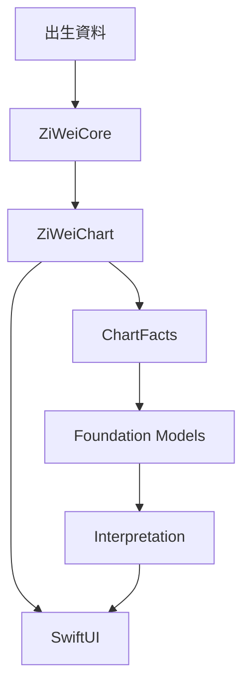
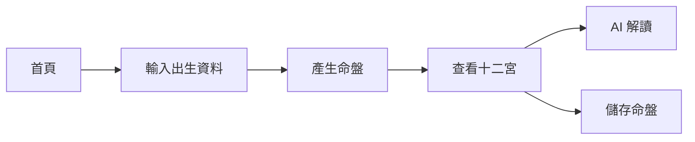
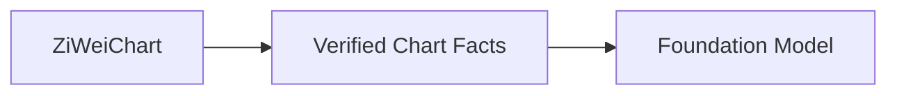
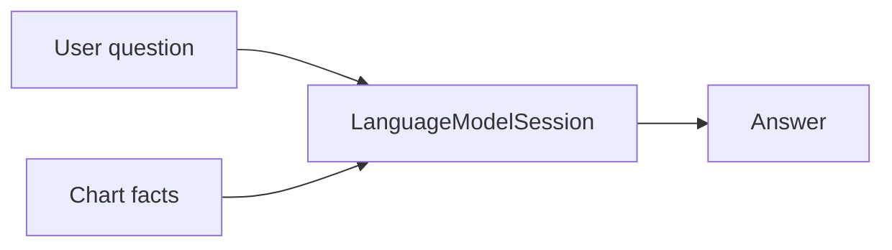
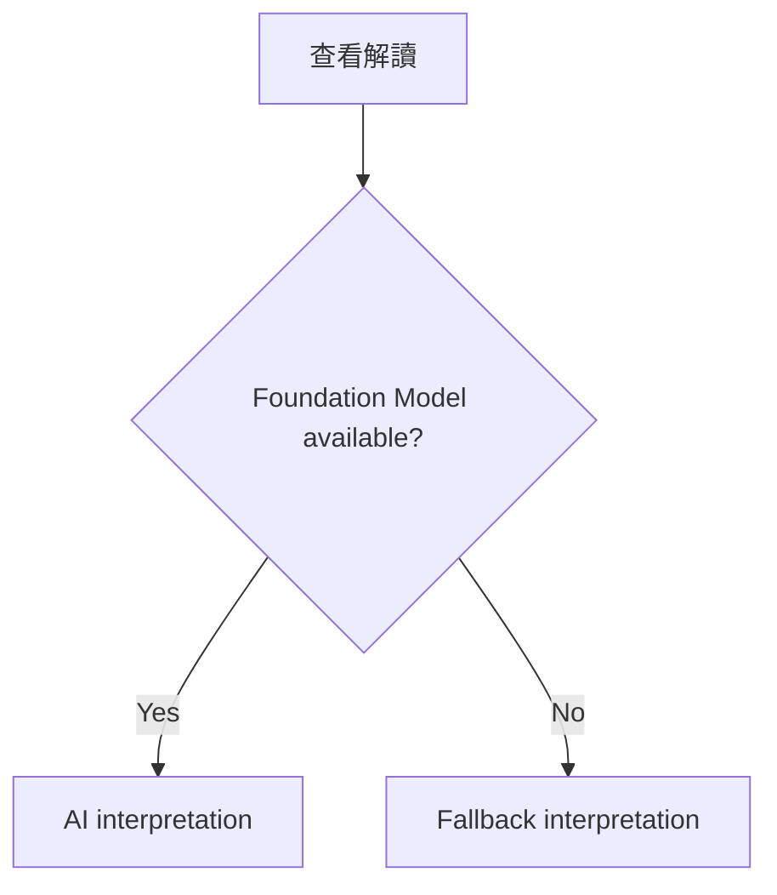

# 很牛的紫微斗數 / Mighty Zi Wei

## 1. Product goal

建立一款簡單、漂亮、一次買斷的純 iOS 紫微斗數 App。

核心價值：

* 正確計算紫微斗數命盤。
* 用清楚、現代的方式呈現命盤。
* 使用 Apple Foundation Models 提供自然語言解讀。
* 命盤計算與基本功能可以完全離線使用。
* 不需要帳號、server 或訂閱。

第一版不追求成為功能最完整的紫微斗數工具。

第一版應優先做到：

> 算得對、看得懂、解讀有趣、操作簡單。

---

# 2. Technical direction

使用：

* Swift
* SwiftUI
* Foundation Models
* SwiftData
* XCTest / Swift Testing

UI policy：

* 所有新 UI 預設使用 SwiftUI。
* UIKit 只用於 SwiftUI 無法合理處理的特殊 rendering、gesture、performance 或 platform integration。
* UIKit 必須隔離在 SwiftUI wrapper 後方。
* 不預先引入 UIKit。

Apple 官方支援透過 `UIViewRepresentable` 和 `UIViewControllerRepresentable` 將 UIKit 元件嵌入 SwiftUI，因此之後如果命盤 renderer 需要 UIKit，不需要重構整個 App。

---

# 3. Architecture



核心原則：

> Foundation Models 永遠不負責排命盤。

所有紫微斗數規則都必須由 deterministic Swift code 計算。

Foundation Models 只負責：

* 整理。
* 解釋。
* 摘要。
* 轉換語氣。
* 根據已計算好的命盤回答問題。

---

# 4. Project structure

```text
MightyZiWei/
├── App/
│   └── MightyZiWeiApp.swift
│
├── Features/
│   ├── Home/
│   ├── BirthInput/
│   ├── Chart/
│   ├── Interpretation/
│   ├── SavedCharts/
│   └── Settings/
│
├── Domain/
│   ├── BirthProfile.swift
│   ├── ZiWeiChart.swift
│   ├── Palace.swift
│   ├── Star.swift
│   ├── Transformation.swift
│   └── ChartFact.swift
│
├── ZiWeiCore/
│   ├── Calendar/
│   ├── Calculator/
│   ├── Rules/
│   └── Tables/
│
├── AI/
│   ├── FoundationModelInterpreter.swift
│   ├── Interpretation.swift
│   └── Prompts/
│
├── Persistence/
│   └── ChartStore.swift
│
└── Platform/
    └── UIKit/
```

`ZiWeiCore` 不得 import：

```swift
SwiftUI
UIKit
FoundationModels
SwiftData
```

它必須是一個單純、可測試的 domain engine。

---

# 5. MVP user flow



第一版只需要五個主要畫面。

---

# 6. Birth input

MVP 輸入：

* 名稱或暱稱。
* 出生日期。
* 出生時間。
* 性別。
* 出生地區或時區，在確定排盤規則需要時加入。

UX 應優先使用 Apple 標準 controls。

不要一開始建立自訂 date picker、time picker 或 navigation。

---

# 7. Zi Wei calculation engine

這是 App 最重要、也是最需要測試的部分。

第一階段至少建立：

* 十二宮。
* 命宮。
* 身宮。
* 宮位天干地支。
* 五行局。
* 十四主星。
* 四化。
* 基本輔星。

之後再逐步加入：

* 大限。
* 流年。
* 流月。
* 流日。
* 更多輔星與煞星。

## Rule

每一個排盤規則都必須：

* deterministic。
* 可以單獨測試。
* 不依賴 LLM。
* 有來源或 reference fixture。
* 避免把大量規則散落在 UI code。

---

# 8. Golden chart tests

建立一組已知正確命盤。

例如：

```text
Fixtures/
├── chart_001.json
├── chart_002.json
├── chart_003.json
└── ...
```

每個 fixture 包含：

```text
出生資料
↓
預期命宮
預期身宮
預期五行局
預期十四主星位置
預期四化
```

所有 calculation engine 修改都必須通過這組 golden tests。

這會是 coding agent 最重要的安全網之一。

---

# 9. Chart facts

不要直接把完整 domain object dump 給 LLM。

建立中介 representation：

```swift
struct ChartFact: Identifiable, Codable {
    let id: String
    let category: Category
    let statement: String
}
```

例如：

```text
F001: 命宮位於午宮。
F002: 紫微星位於命宮。
F003: 天府星位於財帛宮。
F004: 武曲化祿。
```

流程變成：



這層非常重要。

---

# 10. Foundation Models integration

使用 Apple：

```swift
import FoundationModels
```

以：

```swift
LanguageModelSession
```

作為 AI 解讀入口。

Apple 的 Foundation Models framework 提供 stateful session、structured generation、streaming 與 tool calling。

MVP 不需要 tool calling。

第一版只使用：

* Instructions。
* Prompt。
* `@Generable`。
* Streaming。

---

# 11. AI boundary

System instruction 必須明確要求：

```text
You interpret Zi Wei Dou Shu charts.

Only use facts explicitly provided by the application.

Never calculate or infer star positions, palaces, transformations,
calendar conversions, or other chart facts.

Do not invent missing chart information.

Clearly distinguish chart facts from interpretation.
```

這是整個 AI layer 最重要的 rule。

---

# 12. Structured interpretation

不要讓模型直接回傳一大段 Markdown。

使用 `@Generable`。

Apple Foundation Models 的 guided generation 可以直接產生符合 Swift structure 的結果，而不是依賴模型自行產生 JSON。

例如：

```swift
@Generable
struct ChartInterpretation {
    let summary: String
    let sections: [InterpretationSection]
}

@Generable
struct InterpretationSection {
    let title: String
    let content: String
    let evidenceFactIDs: [String]
}
```

結果可以是：

```text
整體性格

你通常具有較強的主導性，
也比較重視自己的判斷。

依據：
- F002 紫微位於命宮
- F007 化權位於命宮
```

這樣使用者可以知道 AI 為什麼這樣解讀。

---

# 13. Initial interpretation categories

MVP 固定提供：

* 命盤總覽。
* 個性。
* 工作與事業。
* 財務傾向。
* 感情與人際。

暫時不要加入：

* 健康診斷。
* 投資建議。
* 精確事件預測。
* 「今年一定會發生什麼」這類高度確定式描述。

---

# 14. Ask your chart

MVP 後期可以加入簡單問答：

```text
「我的工作性格如何？」

「我比較適合穩定還是創業？」

「我的人際關係有什麼特色？」
```

流程：



模型仍然只能使用 `ChartFacts`。

---

# 15. Foundation Models availability

App 不得假設 Foundation Models 一定存在。

Apple 明確要求在使用前檢查 `SystemLanguageModel.availability`，因為 Apple Intelligence 可能：

* 未啟用。
* 裝置不支援。
* 模型尚未下載完成。

因此：



---

# 16. AI fallback

App 是付費買斷產品，因此不能讓不支援 Apple Intelligence 的使用者看到一個壞掉的核心功能。

第一版至少準備 deterministic fallback：

```text
ChartFact
+
Rule-based interpretation templates
```

例如：

```text
紫微位於命宮
→
「紫微坐命通常著重自主、管理與整體掌控。」
```

Foundation Models 可以把這些 rule-based meanings 組合成更自然的文章。

如果模型不可用：

直接顯示原始 rule-based interpretation。

---

# 17. Chart UI

MVP 命盤使用 SwiftUI。

十二宮可以先以：

```swift
Grid
LazyVGrid
Canvas
```

等 SwiftUI API 實作。

只有出現以下問題才考慮 UIKit：

* SwiftUI rendering 明顯有性能問題。
* zoom / pan interaction 難以可靠實作。
* layout 無法穩定控制。
* 有 UIKit-only platform capability。

不要因為「之後可能需要」而提前使用 UIKit。

---

# 18. Visual direction

設計方向：

* Minimal。
* 現代。
* 不要傳統算命網站風格。
* 不使用大量金色、紅色、龍、八卦等裝飾。
* 十二宮是主要視覺焦點。
* AI 解讀像現代閱讀 App，而不是聊天機器人。

首頁應該簡單到：

```text
很牛的紫微斗數

[ 排一張命盤 ]

最近命盤
────────
Narumi
2026/08/22
```

---

# 19. Persistence

使用 SwiftData 儲存：

```swift
SavedChart
```

包含：

* UUID。
* 名稱。
* BirthProfile。
* ZiWeiChart。
* 建立時間。

AI interpretation 是否永久保存可以稍後決定。

MVP 建議重新產生即可。

---

# 20. Privacy

MVP：

* 不建立帳號。
* 不建立 backend。
* 不使用 cloud database。
* 不上傳出生資料。
* Foundation Models 優先使用 on-device system model。

Apple 將 `SystemLanguageModel` 定義為 Apple Intelligence 的 on-device language model。

這可以成為產品賣點：

> 你的命盤，只留在你的 iPhone。

---

# 21. Monetization

商業模式：

```text
Paid App
```

不是：

```text
Free
+
In-App Purchase
```

不是：

```text
Subscription
```

第一版不放：

* 廣告。
* token 點數。
* AI credits。
* 登入。
* 會員制度。

---

# 22. MVP non-goals

第一版明確不做：

* Android。
* Web。
* 帳號。
* Cloud sync。
* 社群。
* 命盤分享圖片。
* 合盤。
* 每日運勢。
* 流日。
* Push notification。
* ChatGPT / Claude API。
* Server-side AI。
* 複雜 UIKit renderer。

---

# 23. Development phases

## Phase 0 — Project foundation

完成：

* Xcode project。
* SwiftUI App。
* Domain structure。
* Testing setup。
* CI。
* AGENTS.md。
* 基本 navigation。

完成條件：

```text
App builds
Tests pass
CI passes
```

---

## Phase 1 — ZiWeiCore

完成 deterministic engine：

```text
BirthProfile
→
ZiWeiChart
```

以及 golden tests。

這個 phase 不做 AI。

完成條件：

> 給定 fixture 出生資料，產生的命盤完全符合預期結果。

---

## Phase 2 — Chart UI

完成：

* BirthInputView。
* ChartView。
* 十二宮。
* 星曜顯示。
* 點擊宮位查看詳細資訊。

完成條件：

> 使用者可以從輸入出生資料一路看到完整基本命盤。

---

## Phase 3 — ChartFacts

建立：

```text
ZiWeiChart
→
[ChartFact]
```

並為每一個 fact 建立 stable ID。

完成條件：

> AI 不需要理解 `ZiWeiChart` implementation 就能取得所有需要資訊。

---

## Phase 4 — Foundation Models

加入：

* availability detection。
* `LanguageModelSession`。
* instructions。
* `@Generable` output。
* streaming。
* error handling。

完成條件：

> Foundation Models 可以只根據 ChartFacts 產生結構化解讀。

---

## Phase 5 — Fallback interpretation

建立 deterministic interpretation rules。

完成條件：

> 關閉 Apple Intelligence 或使用不支援的裝置時，App 仍然具有可用的命盤解讀功能。

---

## Phase 6 — Persistence

加入：

* SwiftData。
* Saved charts。
* Delete。
* Rename。

---

## Phase 7 — Polish

完成：

* Accessibility。
* Dynamic Type。
* Dark Mode。
* loading states。
* empty states。
* error states。
* animations。
* App icon。
* screenshots。

---

## Phase 8 — TestFlight

測試：

* Foundation Models available。
* Apple Intelligence disabled。
* model not ready。
* unsupported device。
* Traditional Chinese。
* multiple birth times。
* edge dates。
* different Dynamic Type sizes。
* Dark Mode。

---

# 24. Coding-agent rules

Coding agent 必須遵守：

```text
- Use SwiftUI for new UI by default.
- Treat UIKit as an exception, not an alternative default.
- Keep ZiWeiCore independent from UI and Foundation Models.
- Never use an LLM to calculate chart facts.
- Every chart calculation rule must be deterministic and tested.
- Add a regression fixture for every discovered chart calculation bug.
- Feed only verified ChartFacts into Foundation Models.
- Never let generated interpretation mutate ZiWeiChart.
- Prefer @Generable structured output over parsing generated JSON.
- Always handle SystemLanguageModel availability.
- Keep the App functional when Foundation Models is unavailable.
- Prefer Apple system controls and standard platform behavior.
- Do not introduce a backend unless a product requirement explicitly
  requires one.
```

---

# 25. MVP success criteria

第一版完成時，應該可以做到：

```text
輸入生日
    ↓
正確排命盤
    ↓
漂亮地查看十二宮
    ↓
查看 AI 解讀
    ↓
詢問自己的命盤
    ↓
儲存命盤
```

而且：

```text
No account
No server
No subscription
No API key
No token cost
```

---

# 26. Unknowns to resolve

目前不要讓 coding agent 自己猜這些事情。

需要另外明確決定：

1. 採用哪一派紫微斗數排盤規則。
2. MVP 包含哪些輔星。
3. 是否加入真太陽時。
4. 是否處理夏令時間與出生地。
5. 大限是否進 MVP。
6. Foundation Models 對繁體中文解讀品質是否達標。
7. 最低支援的 iOS 版本。
8. 不支援 Apple Intelligence 的裝置要提供多完整的 fallback 解讀。

這些應在實作相關功能前轉成明確 specification。

---

# 27. Recommended first milestone

第一個 milestone 不要做整個 App。

只做：

```text
BirthProfile
    ↓
ZiWeiCore
    ↓
ZiWeiChart
    ↓
Golden tests
```

UI 只做一個非常簡單的 debug screen。

Foundation Models 也先不要接。

第一個真正需要證明的問題是：

> 「我們能不能穩定、可測試地算出正確的紫微斗數命盤？」

等這件事完成，再開始做漂亮 UI 與 AI。
