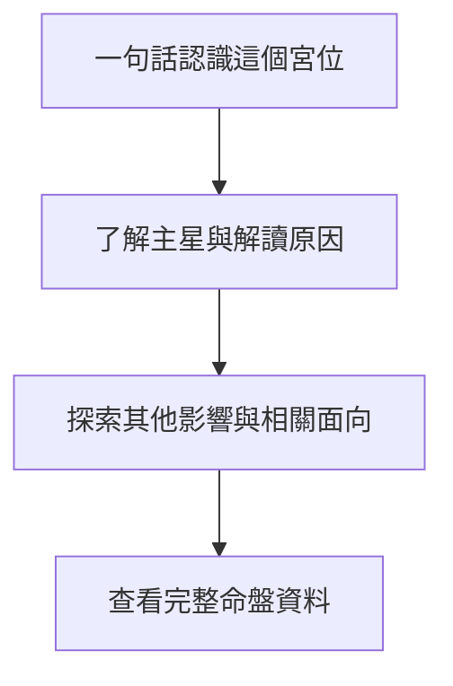

# 很牛的紫微斗數

很牛的紫微斗數是一款 iPhone 原生紫微斗數 App。

第一版以台灣傳統三合派為主、中州派為輔，提供 deterministic 排盤、十二宮閱讀、基本解讀、使用者自行設定的 OpenAI 相容 Responses API 整理、命盤多輪問答與本機儲存。

## MVP 功能

- 輸入公曆出生日期、當地民用時間與 IANA 時區。
- 依 `taiwan-traditional-sanhe` v1 計算命宮、身宮、十二宮干支、五行局與 MVP 星曜。
- 排盤後先以生活化摘要帶使用者認識命宮，再逐步探索主星、其他影響、相關生活面向與完整命盤資料。
- 十二宮、宮位干支、四化與三方四正仍完整保留，但不會早於使用者需要的解釋出現。
- 顯示附有已驗證依據的五類基本解讀。
- 使用者可自行設定 HTTPS OpenAI 相容 API base URL 或完整 Responses API endpoint，未以 `/responses` 結尾時 App 會自動補齊路徑，並以非串流請求整理解讀文字。
- API 設定畫面可發出不含命盤資料的小型 request，確認 endpoint、model、授權與 structured output 是否可用。
- 底部「AI」分頁可針對目前或已儲存命盤進行最多十輪問答，每個有效回答都會顯示 App 驗證過的命盤依據。
- 對話只保存在本次 App 執行期間；切換命盤會先確認並清除本次對話。
- API 未設定、請求失敗或驗證失敗時，完整的 deterministic 基本解讀仍可正常使用。
- API key 可依服務需求留空；非空 key 只儲存在不可同步的 iOS Keychain，不寫入 SwiftData、記錄或 repository。
- 使用 SwiftData 儲存、重新命名與刪除命盤。
- 不需要帳號、開發者後端或訂閱。
- 第三方 API 可能收費，資料處理與保留受使用者所選服務商的條款及隱私政策約束。

## 技術需求

- Xcode 26 或更新版本。
- iOS 26 SDK。
- XcodeGen 2.46 或相容版本。

## 產生專案

iOS 專案位於 `apps/ios/`。

```sh
brew install xcodegen
cd apps/ios
xcodegen generate
open MightyZiWei.xcodeproj
```

`apps/ios/project.yml` 是 Xcode project 的 source of truth。

## 建置與測試

```sh
cd apps/ios
DEVELOPER_DIR=/Applications/Xcode.app/Contents/Developer \
xcodebuild test \
-project MightyZiWei.xcodeproj \
-scheme MightyZiWei \
-destination 'platform=iOS Simulator,name=iPhone 17 Pro' \
CODE_SIGNING_ALLOWED=NO
```

## TestFlight 外部測試

每次上傳前，先在 `apps/ios/project.yml` 增加 `CURRENT_PROJECT_VERSION`，再於 `apps/ios/` 執行 `xcodegen generate`。

以下指令會使用 `apps/ios/Configuration/TestFlightExternalExportOptions.plist` 上傳可供外部測試的建置。
該設定明確將 `testFlightInternalTestingOnly` 設為 `false`。

```sh
cd apps/ios
rm -rf /tmp/MightyZiWei.xcarchive /tmp/MightyZiWei-upload

DEVELOPER_DIR=/Applications/Xcode.app/Contents/Developer \
xcodebuild archive \
-project MightyZiWei.xcodeproj \
-scheme MightyZiWei \
-configuration Release \
-destination 'generic/platform=iOS' \
-archivePath /tmp/MightyZiWei.xcarchive \
-allowProvisioningUpdates

DEVELOPER_DIR=/Applications/Xcode.app/Contents/Developer \
xcodebuild -exportArchive \
-archivePath /tmp/MightyZiWei.xcarchive \
-exportPath /tmp/MightyZiWei-upload \
-exportOptionsPlist Configuration/TestFlightExternalExportOptions.plist \
-allowProvisioningUpdates
```

不要在 Xcode Organizer 選擇「TestFlight Internal Only」。
該選項一旦用於上傳，該建置便不能改供外部測試，必須增加建置版本並重新上傳。
上傳完成後，仍需在 App Store Connect 填寫測試資訊、建立外部測試群組，並提交 Beta App Review。

## 新手探索方式

每個宮位先回答「這跟我有什麼關係」，再說明 App 為什麼這樣解讀。

主星、其他星曜與三方四正會在使用者主動深入時逐步出現。

原始排盤資料保留在宮位頁底部，熟悉紫微斗數的使用者仍可直接核對。

宮位頁提供的 AI 延伸問題只會填入問題草稿，不會自動送出或產生第三方費用。



## 架構


`ZiWeiCore` 不依賴 SwiftUI、UIKit、網路 API 或 SwiftData。

Responses API 不參與排盤，也不能新增 App 未提供的命理含義。

命盤問答只使用 App 產生的 verified ChartFacts、InterpretationSeeds、本次問題與已驗證的本次對話。

## 隱私

App 不會將出生資料、命盤、prompt 或解讀傳送到開發者控制的伺服器。

只有使用者啟用 AI 整理或主動提問時，App 才會將必要的命盤 facts、interpretation seeds、問題、本次對話與 prompt 直接傳送到使用者設定的第三方 HTTPS endpoint。

API key 只儲存在 iOS Keychain。

第三方可能依其方案收費，並依其條款與隱私政策處理資料。

詳細內容請參閱 `Documentation/PRIVACY.md`。

## 介面驗證

UI tests 會驗證首頁、命盤總覽、宮位詳情、基本解讀、AI 分頁、多輪問答、Dark Mode 與最大 Dynamic Type。

測試截圖只保存在本機的 `.xcresult` 測試結果中，不納入 repository。

## 規則狀態

完整規則、來源與流派差異記錄於 `RULESET.md`。

正式發布前仍須完成文件列出的三合派專家審查與獨立 golden chart 人工核對。

## 授權

本專案依 repository 內的 `LICENSE` 提供。
