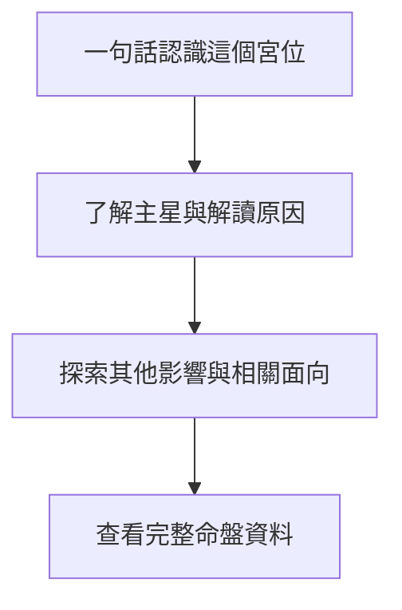
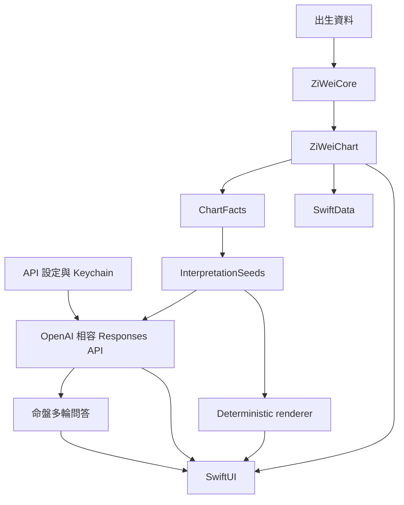

# 很牛的紫微斗數

很牛的紫微斗數是一款原生 iPhone 紫微斗數 App，也提供可獨立安裝的紫微斗數 Agent Skill。

本專案以台灣常見的傳統三合派為主、中州派為輔。

核心原則是可重現的排盤、可追溯的解讀與漸進式閱讀體驗。

## 專案內容

### iPhone App

第一版提供以下功能：

- 輸入公曆出生日期、出生地當地民用時間與 IANA 時區。
- 依 `taiwan-traditional-sanhe` v1 計算命宮、身宮、十二宮干支、五行局與 MVP 星曜。
- 依序探索命宮摘要、主星、其他影響、相關生活面向與完整命盤資料。
- 顯示附有已驗證依據的命盤總覽、個性、工作與事業、財務傾向、感情與人際解讀。
- 使用本機 deterministic 基本解讀，不需要 API 或網路。
- 使用自行設定的 OpenAI 相容 Responses API 整理解讀文字與進行最多十輪命盤問答。
- 在「命盤 AI」以正體中文語音建立可編輯的問題草稿，確認後才由使用者手動送出。
- 手動朗讀命盤解讀段落與單則命盤助理回答，並提供暫停、繼續與停止操作。
- 接受 HTTPS API base URL 或完整 Responses API endpoint，並提供不含命盤資料的連線測試。
- 使用 SwiftData 儲存、重新命名與刪除命盤。
- 不需要帳號、開發者控制的後端或 App 訂閱。

### 紫微斗數 Agent Skill

使用支援 Agent Skills 的工具時，可直接從本 repository 安裝紫微斗數本命盤解讀 Skill。

```sh
npx skills add narumiruna/mighty-zi-wei
```

Skill 以三合派判讀為主。

內容涵蓋命身十二宮、十四主星、生年四化、三方四正、古籍查證與 `ChartFact` 證據規則。

Skill 的實體檔案位於 `skills/interpreting-ziwei-natal-chart/`。

`.agents/skills/interpreting-ziwei-natal-chart` 是供 Agent 探索的相對 symbolic link。

## 使用限制與隱私

紫微斗數解讀只供娛樂與自我反思，不應取代醫療、法律、投資或其他專業意見。

App 不會將出生資料、命盤、prompt 或解讀傳送到開發者控制的伺服器。

只有使用者主動使用雲端 AI 時，App 才會傳送資料到使用者設定的第三方 HTTPS endpoint。

語音辨識只會更新裝置上的可編輯問題草稿，不會自動送出、產生第三方 API 費用或保存音訊檔案。

使用者最後主動送出問題後，App 才會傳送文字問題、已驗證的命盤事實、基礎解讀、本次對話與 prompt。

API key 可依服務需求留空。

非空的 API key 只儲存在不可同步的 iOS Keychain，不會寫入 SwiftData、診斷記錄或 repository。

第三方服務可能收費，並依其服務條款、隱私政策與資料保留設定處理請求內容。

API 未設定、請求失敗或驗證失敗時，本機 deterministic 基本解讀仍可使用。

完整說明請參閱 [`docs/PRIVACY.md`](docs/PRIVACY.md)。

問題回報方式請參閱 [`docs/SUPPORT.md`](docs/SUPPORT.md)。

## 開發者快速開始

### 技術需求

- Xcode 26 或更新版本。
- iOS 26 SDK。
- XcodeGen 2.46 或相容版本。

### Repository 結構

```text
apps/ios/                                iOS App、測試與 XcodeGen 設定
skills/interpreting-ziwei-natal-chart/   紫微斗數 Agent Skill
docs/                                    隱私權與支援文件
RULESET.md                               排盤 canonical specification
PRODUCT.md                               產品需求與發布條件
```

### 產生 iOS 專案

`apps/ios/project.yml` 是 Xcode project 的 source of truth。

```sh
brew install xcodegen
cd apps/ios
xcodegen generate
open MightyZiWei.xcodeproj
```

修改 `project.yml` 後必須重新執行 `xcodegen generate`。

### 建置與測試

```sh
cd apps/ios
DEVELOPER_DIR=/Applications/Xcode.app/Contents/Developer \
xcodebuild test \
-project MightyZiWei.xcodeproj \
-scheme MightyZiWei \
-destination 'platform=iOS Simulator,name=iPhone 17 Pro' \
CODE_SIGNING_ALLOWED=NO
```

UI tests 會驗證首頁、命盤總覽、宮位詳情、基本解讀、AI 分頁、多輪問答、Dark Mode 與最大 Dynamic Type。

測試截圖只保存在本機 `.xcresult` 測試結果中，不得納入 repository。

## TestFlight 外部測試

每次上傳前，先在 `apps/ios/project.yml` 增加 `CURRENT_PROJECT_VERSION`，再於 `apps/ios/` 執行 `xcodegen generate`。

以下指令使用 `apps/ios/Configuration/TestFlightExternalExportOptions.plist` 建立並上傳可供外部測試的建置。

該設定將 `testFlightInternalTestingOnly` 明確設為 `false`。

```sh
cd apps/ios
rm -rf /tmp/MightyZiWei.xcarchive /tmp/MightyZiWei-upload

DEVELOPER_DIR=/Applications/Xcode.app/Contents/Developer \
xcodebuild archive \
-project MightyZiWei.xcodeproj \
-scheme MightyZiWei \
-configuration Release \
-destination 'generic/platform=iOS' \
-archivePath /tmp/MightyZiWei.xcarchive \
-allowProvisioningUpdates

DEVELOPER_DIR=/Applications/Xcode.app/Contents/Developer \
xcodebuild -exportArchive \
-archivePath /tmp/MightyZiWei.xcarchive \
-exportPath /tmp/MightyZiWei-upload \
-exportOptionsPlist Configuration/TestFlightExternalExportOptions.plist \
-allowProvisioningUpdates
```

不要在 Xcode Organizer 選擇「TestFlight Internal Only」。

使用該選項上傳的建置不能改供外部測試，必須增加建置版本並重新上傳。

上傳完成後，仍須在 App Store Connect 填寫測試資訊、建立外部測試群組並提交 Beta App Review。

## 閱讀體驗

每個畫面只呈現完成目前任務所需的資訊與操作。

宮位頁先回答「這跟我有什麼關係」，再讓使用者主動展開主星、其他影響、三方四正與完整排盤資料。

宮位頁提供的 AI 延伸問題只會填入問題草稿，不會自動送出或產生第三方費用。



## 架構

`ZiWeiCore` 不依賴 SwiftUI、UIKit、網路 API 或 SwiftData。

Responses API 不參與排盤，也不能新增 App 未提供的命理含義。

命盤問答只使用 App 產生的 verified `ChartFact`、`InterpretationSeed`、目前問題與已驗證的本次對話。



## 排盤規則與發布條件

[`RULESET.md`](RULESET.md) 是排盤規則、來源與流派差異的 canonical specification。

相同輸入與 ruleset version 必須產生相同命盤。

排盤不得依賴網路、外部 AI API、裝置語系、目前日期或隨機數。

任何會改變排盤結果的規則修改都必須提升 ruleset version 並新增 regression fixture。

正式發布前仍須由熟悉台灣傳統三合派的人員核對 canonical tables 與部分 golden charts。

完整產品需求與發布條件記錄於 [`PRODUCT.md`](PRODUCT.md)。

## 授權

本專案依 repository 內的 [`LICENSE`](LICENSE) 提供。
