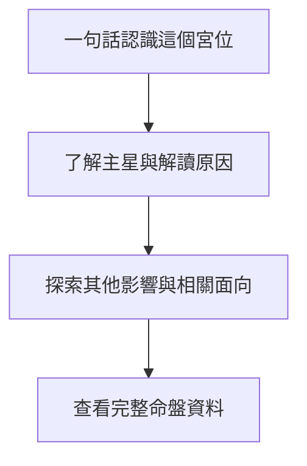
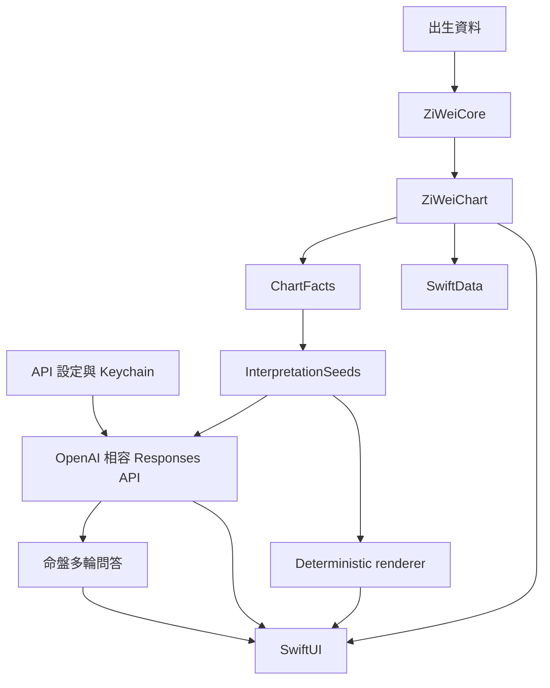

# 很牛的紫微斗數

很牛的紫微斗數是一款原生 iPhone 紫微斗數 App，也提供可獨立安裝的紫微斗數 Agent Skill。

本專案以台灣常見的傳統三合派為主、中州派為輔。

核心原則是可重現的排盤、可追溯的解讀與漸進式閱讀體驗。

## 專案內容

### iPhone App

第一版提供以下功能：

- 輸入公曆出生日期、出生地當地民用時間與 IANA 時區。
- 依 `taiwan-traditional-sanhe` v1 計算命宮、身宮、十二宮干支、五行局與 MVP 星曜。
- 命盤總覽依序呈現命宮生活化摘要、「閱讀命盤解讀」與「問命盤助理」、十二宮，以及筆記與次要工具。
- 宮位內容依序揭露摘要、主星、其他影響、相關生活面向與完整命盤資料。
- 以「閱讀命盤解讀」查看附有已驗證依據的命盤總覽、個性、工作與事業、財務傾向、感情與人際。
- 解讀畫面先顯示目前來源，而且不需要 API 或網路的本機 deterministic 基本解讀會一直保留。
- 選擇性使用自行設定的 OpenAI 相容 Responses API 整理既有解讀，App 會檢查回傳格式、內容安全與引用依據，並讓基本解讀與有效的 AI 整理版本並存及切換。
- 以「問命盤」進入命盤助理，針對目前命盤進行最多十輪問答。
- 在「問命盤」以正體中文語音建立可編輯的命盤助理問題草稿，完成編輯後由使用者手動送出。
- 手動朗讀命盤解讀段落與單則命盤助理回答，並提供暫停、繼續與停止操作。
- 接受 HTTPS API base URL 或完整 Responses API endpoint，並以畫面草稿分開「測試目前欄位」、「儲存」與取消。
- 連線測試不含命盤資料且不會儲存草稿，只有明確儲存才套用 API 欄位、回答長度與每月上限。
- 使用 SwiftData 儲存、重新命名與刪除命盤，並可依姓名、標籤與建立日期搜尋。
- 已儲存分頁在沒有命盤時提供排盤入口，搜尋或篩選沒有結果時會說明生效條件並提供對應的清除操作。
- 尚未儲存的命盤會停用收藏，並在控制旁顯示「先儲存命盤才能收藏」。
- 支援自訂標籤、常用命盤釘選及相同出生資料偵測。
- 比較目前時辰與相鄰時辰的命宮、身宮、主星及四化位置，不替使用者猜測出生時辰。
- 並列兩張已儲存命盤的既有宮位與主星 facts，作為不含適配度判定的互動參考。
- 以觀察時間軸保存私人筆記、自我觀察標記、宮位／解讀／命盤依據連結與使用者自訂回顧提醒。
- 在本機保存保留 `evidenceFactIDs` 的解讀與 AI 回答收藏。
- 持續顯示目前對話的本機保存狀態，由使用者主動建立或更新同一份保存副本。
- 已保存命盤助理對話支援重新命名、搜尋與純文字匯出，而且不會自動同步。
- 提供既有星曜、十二宮、四化與三方四正的小百科。
- 分享預設隱藏姓名與完整出生資料的純文字命盤摘要。
- 提供 Face ID、Touch ID 或裝置密碼 App 鎖，並在背景立即遮住內容。
- 分享個資前再次列出並確認將包含的名稱與出生資料。
- 提供 AI 整理傳送預覽、回答長度與每月請求上限，以及不含秘密的可複製診斷。
- 可在資料揭露後選擇把命盤、筆記與收藏同步到 Apple 私人 CloudKit 資料庫，並以較新版本與刪除 tombstone 處理衝突。
- 確認啟用後會先顯示已啟用再開始同步；部分遠端同步失敗時仍保持啟用、保留本機資料並可安全重試。
- 關閉同步只停止後續同步，不會自動刪除 iCloud 已有資料。
- 提供 App Intents、預設不顯示個資的回顧 Widget、VoiceOver 線性命盤與出生資料檢查卡。
- 以 AES-GCM 和隨機 256-bit 復原金鑰加密匯出命盤、筆記與收藏備份。
- 不需要建立 App 帳號、開發者控制的後端或 App 訂閱；選擇性 iCloud 同步使用裝置已登入的 Apple ID。

### 紫微斗數 Agent Skill

使用支援 Agent Skills 的工具時，可直接從本 repository 安裝紫微斗數本命盤解讀 Skill。

```sh
npx skills add narumiruna/mighty-zi-wei
```

Skill 以三合派判讀為主。

內容涵蓋命身十二宮、十四主星、生年四化、三方四正、古籍查證與 `ChartFact` 證據規則。

Skill 的實體檔案位於 `skills/interpreting-ziwei-natal-chart/`。

`.agents/skills/interpreting-ziwei-natal-chart` 是供 Agent 探索的相對 symbolic link。

## 使用限制與隱私

紫微斗數解讀只供娛樂與自我反思，不應取代醫療、法律、投資或其他專業意見。

App 不會將出生資料、命盤、prompt 或解讀傳送到開發者控制的伺服器。

只有使用者主動使用雲端 AI 時，App 才會傳送資料到使用者設定的第三方 HTTPS endpoint。

語音辨識只會更新裝置上的可編輯問題草稿，不會自動送出、產生第三方 API 費用或保存音訊檔案。

每次 AI 整理前都會先顯示傳送預覽。

預覽第一層會顯示整理效果、必要命盤依據與本機請求影響；facts、seeds 與 model 等技術資訊由使用者主動展開。

命盤助理會在使用者點選送出問題後，直接傳送文字問題、已驗證的命盤事實、基礎解讀、本次對話與 prompt。

AI 整理則在使用者最後主動確認後傳送整理所需的命盤依據與 prompt。

API key 可依服務需求留空。

非空的 API key 只儲存在不可同步的 iOS Keychain，不會寫入 SwiftData、診斷記錄、分享摘要或加密備份。

筆記、自我觀察標記、收藏與使用者主動保存的 AI 對話預設只保存在本機。

只有使用者主動開啟選擇性 iCloud 同步後，命盤、筆記與收藏才會進入 Apple 私人 CloudKit 資料庫；AI 對話、API 設定與 API key 不會同步。

使用者主動建立加密備份時，App 只匯出命盤 source-of-truth、筆記與收藏，不匯出 API 設定、AI 對話或衍生命盤快取。

備份檔與復原金鑰必須分開保存；App 不會保存復原金鑰，也無法協助找回遺失的金鑰。

第三方服務可能收費，並依其服務條款、隱私政策與資料保留設定處理請求內容。

API 設定的畫面變更先保留為草稿，測試目前欄位不會儲存，取消或返回會捨棄未儲存草稿。

只有使用者明確儲存後，App 才會套用 endpoint、model、API key、回答長度與每月上限。

若儲存失敗，App 會嘗試保留先前設定；若連復原也無法完整完成，App 會停用 AI 並要求重新檢查及儲存設定。

API 未設定、請求失敗或驗證失敗時，本機 deterministic 基本解讀仍可使用。

完整說明請參閱 [`docs/PRIVACY.md`](docs/PRIVACY.md)。

問題回報方式請參閱 [`docs/SUPPORT.md`](docs/SUPPORT.md)。

## 開發者快速開始

### 技術需求

- Xcode 26 或更新版本。
- iOS 26 SDK。
- XcodeGen 2.46 或相容版本。

### Repository 結構

```text
apps/ios/                                iOS App、測試與 XcodeGen 設定
skills/interpreting-ziwei-natal-chart/   紫微斗數 Agent Skill
docs/                                    隱私權與支援文件
RULESET.md                               排盤 canonical specification
PRODUCT.md                               產品需求與發布條件
```

### 產生 iOS 專案

`apps/ios/project.yml` 是 Xcode project 的 source of truth。

```sh
brew install xcodegen
cd apps/ios
xcodegen generate
open MightyZiWei.xcodeproj
```

修改 `project.yml` 後必須重新執行 `xcodegen generate`。

### 建置與測試

```sh
cd apps/ios
DEVELOPER_DIR=/Applications/Xcode.app/Contents/Developer \
xcodebuild test \
-project MightyZiWei.xcodeproj \
-scheme MightyZiWei \
-destination 'platform=iOS Simulator,name=iPhone 17 Pro' \
CODE_SIGNING_ALLOWED=NO
```

UI tests 的範圍包含首頁、命盤總覽順序、宮位詳情、解讀來源與版本切換、已儲存空白及篩選復原、API 設定草稿、iCloud 同步狀態、問命盤多輪問答、Dark Mode 與最大 Dynamic Type。

完整 UI tests、實機平台整合與人工無障礙檢查仍須依 `PRODUCT.md` 的發布條件完成，文件不把尚未執行的驗證視為已通過。

測試截圖只保存在本機 `.xcresult` 測試結果中，不得納入 repository。

## TestFlight 外部測試

每次上傳前，先在 `apps/ios/project.yml` 增加 `CURRENT_PROJECT_VERSION`，再於 `apps/ios/` 執行 `xcodegen generate`。

以下指令使用 `apps/ios/Configuration/TestFlightExternalExportOptions.plist` 建立並上傳可供外部測試的建置。

該設定將 `testFlightInternalTestingOnly` 明確設為 `false`。

```sh
cd apps/ios
rm -rf /tmp/MightyZiWei.xcarchive /tmp/MightyZiWei-upload

DEVELOPER_DIR=/Applications/Xcode.app/Contents/Developer \
xcodebuild archive \
-project MightyZiWei.xcodeproj \
-scheme MightyZiWei \
-configuration Release \
-destination 'generic/platform=iOS' \
-archivePath /tmp/MightyZiWei.xcarchive \
-allowProvisioningUpdates

DEVELOPER_DIR=/Applications/Xcode.app/Contents/Developer \
xcodebuild -exportArchive \
-archivePath /tmp/MightyZiWei.xcarchive \
-exportPath /tmp/MightyZiWei-upload \
-exportOptionsPlist Configuration/TestFlightExternalExportOptions.plist \
-allowProvisioningUpdates
```

不要在 Xcode Organizer 選擇「TestFlight Internal Only」。

使用該選項上傳的建置不能改供外部測試，必須增加建置版本並重新上傳。

上傳完成後，仍須在 App Store Connect 填寫測試資訊、建立外部測試群組並提交 Beta App Review。

## 閱讀體驗

每個畫面只呈現完成目前任務所需的資訊與操作。

宮位頁先回答「這跟我有什麼關係」，再讓使用者主動展開主星、其他影響、三方四正與完整排盤資料。

宮位頁提供的命盤助理延伸問題只會填入問題草稿，不會自動送出或產生第三方費用。

命盤總覽先呈現命宮生活化摘要，再提供兩個主要後續操作，之後才顯示十二宮與命盤工具：

1. 「閱讀命盤解讀」提供完整、可離線使用的基本內容。
2. 「問命盤助理」用於生活化問題、追問與回答依據。
3. 「自由探索十二宮」用於查看主星分布與完整宮位內容。
4. 「命盤工具」包含筆記與收藏、相鄰時辰比較及完整排盤資料。

解讀畫面第一個區塊會標示「基本解讀・本機」或「AI 整理・第三方」。

取得通過驗證的 AI 整理後，基本解讀不會被覆蓋，兩個版本可以隨時切換。

AI 重新整理失敗或取消時，目前來源、基本解讀與上一份有效 AI 整理都會保留。

命盤助理會持續顯示目前命盤、可回答範圍、等待／停止／失敗狀態，以及哪些輪次尚未保存。



## 架構

`ZiWeiCore` 不依賴 SwiftUI、UIKit、網路 API 或 SwiftData。

Responses API 不參與排盤；App 會要求模型不得新增未提供的命理含義，但無法保證模型不會改變語意，因此基本解讀會持續保留供對照。

命盤問答只使用 App 產生的 verified `ChartFact`、`InterpretationSeed`、目前問題與已驗證的本次對話。



## 排盤規則與發布條件

[`RULESET.md`](RULESET.md) 是排盤規則、來源與流派差異的 canonical specification。

相同輸入與 ruleset version 必須產生相同命盤。

排盤不得依賴網路、外部 AI API、裝置語系、目前日期或隨機數。

任何會改變排盤結果的規則修改都必須提升 ruleset version 並新增 regression fixture。

正式發布前仍須由熟悉台灣傳統三合派的人員核對 canonical tables 與部分 golden charts。

完整產品需求與發布條件記錄於 [`PRODUCT.md`](PRODUCT.md)。

## 授權

本專案依 repository 內的 [`LICENSE`](LICENSE) 提供。
