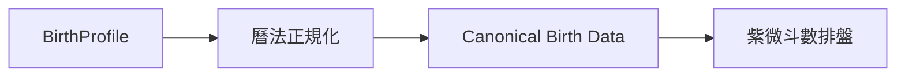

# 很牛的紫微斗數規則集

## 1. 文件目的

本文件定義「很牛的紫微斗數」所採用的紫微斗數排盤規則。

`ZiWeiCore` 必須將本文件與其引用的 canonical tables 視為排盤規格。

所有排盤規則必須具備以下性質：

- deterministic；
- 可測試；
- 可追溯；
- 可版本化；
- 可由人工審查；
- 不依賴 UI；
- 不依賴 LLM。

若不同派別存在歧義，而本文件尚未定義，實作不得自行猜測。

---

## 2. 規則集識別

```text
ruleset_id: taiwan-traditional-sanhe
ruleset_version: 1
status: proposed
```

`1` 為 MVP 初始規則提案，並與 `PRODUCT.md` 的 rule set identity 一致。

本規則集不宣稱代表所有紫微斗數派別。

---

## 3. 採用派別

MVP 採用：

```text
基礎系統：
三合派／星曜派

四化：
生年四化
```

MVP 主要使用：

- 十二宮；
- 十四主星；
- 輔星與煞星；
- 三方四正；
- 生年四化；
- 五行局；
- 命宮；
- 身宮。

MVP 暫不採用：

- 宮干飛化；
- 完整飛星四化；
- 欽天四化專屬規則；
- 自化；
- 飛宮；
- 河洛派專屬規則；
- 太歲入卦；
- 紫雲派三代論；
- 其他現代門派特有規則。

不同流派的規則不得隱式混用。

未來新增流派時，應使用獨立 ruleset。

---

## 4. 規則優先順序

不同來源互相衝突時，依下列順序判定：

1. 本文件明確定義的規則；
2. repository 中已核准的 canonical tables；
3. 已核准的 golden chart fixtures；
4. 該規則指定的主要參考資料；
5. 次要參考資料；
6. 第三方排盤網站或 App。

第三方排盤結果只能作為交叉驗證。

不得只因為某個第三方工具產生不同結果，就直接修改實作。

---

## 5. 規則追蹤

每一條非平凡排盤規則都必須具有穩定的 rule ID。

建議格式：

```text
R-CALENDAR-001
R-MING-001
R-SHEN-001
R-PALACE-001
R-WUXING-001
R-ZIWEI-001
R-MAINSTAR-001
R-SIHUA-001
```

每條規則至少記錄：

```yaml
id: R-MING-001
name: 安命宮
status: verified
source:
  title: ""
  edition: ""
  page: ""
notes: ""
```

允許的 `status`：

```text
verified
provisional
disputed
unresolved
```

`verified` 表示已人工確認採用。

`provisional` 表示暫時採用，但仍需查證。

`disputed` 表示不同來源存在差異。

`unresolved` 表示尚無足夠依據選定規則，因此禁止實作。

`disputed` 規則必須記錄本專案實際採用的行為與已知替代方案。

---

## 6. 輸入資料

排盤的 canonical input 為出生資料。

```swift
struct BirthProfile {
    let localDate: LocalDate
    let localTime: LocalTime
    let calendarIdentifier: CalendarIdentifier
    let timeZoneIdentifier: String
}
```

姓名與暱稱只能作為 metadata。

姓名與暱稱不得影響排盤結果。

MVP 必填：

```text
公曆出生日期
出生地當地民用時間
IANA time zone identifier
```

MVP 支援 1900-01-01 至 2099-12-31。

排盤使用出生地的 local civil date 與 wall-clock time，不得先轉換成台灣時間或 UTC 再決定農曆日期與時辰。

MVP 本命盤不使用或收集性別與出生地經緯度。

未來只有在大限等規則確實需要時，才能加入性別參數並說明用途。

---

## 7. 曆法規則

曆法轉換必須與紫微斗數規則分離。



所有星曜計算必須使用同一份正規化後的出生資料。

建議 canonical representation：

```swift
struct ZiWeiBirthData {
    let lunarYear: Int
    let lunarMonth: Int
    let lunarDay: Int
    let isLeapMonth: Bool

    let yearStem: HeavenlyStem
    let yearBranch: EarthlyBranch
    let hourBranch: EarthlyBranch
}
```

### 7.1 國曆與農曆

國曆轉農曆必須由 deterministic calendar component 處理。

曆法模組必須有獨立測試。

曆法模組不得依賴 Foundation Models。

### 7.2 閏月

必須保留 `isLeapMonth`。

不得在 calendar layer 中丟失閏月資訊。

MVP 的閏月排盤規則目前尚未定案：

```text
leap_month_policy: unresolved
```

在支援閏月出生資料前，必須先明確指定規則。

### 7.3 換日

MVP 使用 local civil date 的午夜作為日期邊界。

23:00 至 00:59 都屬子時，但 23:00 至 23:59 不提前改用次日日期。

不得自行套用「子初換日」或其他特殊換日規則。

若未來採用其他換日方式，必須：

- 更新本文件；
- bump ruleset version；
- 加入邊界測試。

### 7.4 真太陽時

MVP 不使用真太陽時。

```text
true_solar_time: disabled
```

未來若加入，必須另外定義：

- 經度修正；
- Equation of Time；
- 時區；
- 夏令時間；
- 歷史時區；
- 日期跨界；
- 子時跨界。

---

## 8. 十二地支

canonical order：

```text
子
丑
寅
卯
辰
巳
午
未
申
酉
戌
亥
```

程式碼中不得依賴 localized display string 作為邏輯識別。

應使用 enum 或 stable ID。

---

## 9. 十二宮

canonical palace set：

```text
命宮
兄弟宮
夫妻宮
子女宮
財帛宮
疾厄宮
遷移宮
僕役宮
官祿宮
田宅宮
福德宮
父母宮
```

內部 stable IDs 建議：

```text
life
siblings
spouse
children
wealth
health
travel
friends
career
property
fortune
parents
```

顯示名稱與 stable ID 必須分離。

---

## 10. 命宮與身宮

命宮與身宮的計算必須：

- 使用獨立 calculator；
- 使用明確 rule ID；
- 不依賴十四主星計算；
- 不依賴四化；
- 可單獨測試。

命宮規則：

```text
status: provisional
rule_id: R-MING-001
```

身宮規則：

```text
status: provisional
rule_id: R-SHEN-001
```

正式實作前，必須將實際安宮公式與來源補入 canonical rule table。

---

## 11. 宮位天干地支

十二宮的地支排列必須使用固定 canonical order。

宮位天干必須由出生年天干與既定起干規則計算。

不得直接把第三方命盤結果寫成 lookup exception。

宮位干支規則應放置於：

```text
ZiWeiCore/Rules/Palace/
```

---

## 12. 五行局

MVP 必須支援：

```text
水二局
木三局
金四局
土五局
火六局
```

五行局必須由命宮干支依 canonical table 計算。

不得由 LLM 推論。

五行局 table 必須：

- 明確列出完整輸入與輸出；
- 有來源；
- 有 unit tests；
- 不依賴 UI 字串。

---

## 13. 十四主星

MVP 必須支援十四主星：

```text
紫微
天機
太陽
武曲
天同
廉貞
天府
太陰
貪狼
巨門
天相
天梁
七殺
破軍
```

內部必須使用 stable ID。

例如：

```text
ziWei
tianJi
taiYang
wuQu
tianTong
lianZhen
tianFu
taiYin
tanLang
juMen
tianXiang
tianLiang
qiSha
poJun
```

### 13.1 紫微星

紫微星位置必須根據：

```text
五行局
+
農曆生日
```

依 canonical 安紫微表或等價 deterministic algorithm 計算。

不得要求模型推理安星。

### 13.2 其餘主星

其餘十三主星必須根據紫微星或天府星位置，依固定星系排列規則安置。

所有相對位移必須集中在 canonical table。

不得把 offset magic numbers 散落在不同 calculator。

---

## 14. 生年四化

MVP 僅計算生年四化。

```text
化祿
化權
化科
化忌
```

四化由出生年天干決定。

canonical table 必須完整列出十天干的：

```text
祿
權
科
忌
```

對應星曜。

四化 table 必須具備：

- stable source；
- unit tests；
- golden chart coverage。

MVP 不因宮干重新產生第二組四化。

---

## 15. 輔星與煞星

MVP 第一階段星曜範圍固定為：

```text
六吉：左輔、右弼、文昌、文曲、天魁、天鉞
六煞：擎羊、陀羅、火星、鈴星、地空、地劫
其他：祿存、天馬
```

每新增一顆星曜，必須同時加入：

1. stable star ID；
2. category；
3. placement rule；
4. rule ID；
5. source；
6. unit test；
7. 至少一個 fixture coverage。

不得因為「一般命盤都有」就直接新增規則。

上述星曜的安星法在來源與 canonical tables 完成前維持 `unresolved`，不得先行實作。

---

## 16. 廟旺利陷

MVP 是否顯示廟旺利陷必須與主星安置分離。

廟旺利陷不得影響星曜所在宮位。

若加入，必須以獨立 canonical table 實作。

不同來源的廟旺利陷表若有差異，必須指定本 ruleset 採用哪一份。

MVP 不顯示廟旺利陷。

```text
temple_brightness: deferred
```

---

## 17. 三方四正

三方四正屬於 interpretation facts。

其結構關係可以由 deterministic code 計算。

對任一宮位：

```text
本宮
+
對宮
+
兩個三合宮
```

必須能產生 stable relationship。

三方四正的計算不得依賴自然語言 interpretation。

---

## 18. 大限

MVP 第一階段不要求大限。

```text
major_limit: deferred
```

加入大限前必須先明確定義：

- 順行與逆行規則；
- 起限歲數；
- 虛歲或實歲；
- 性別規則；
- 陰陽年規則；
- 宮位排列。

不得在未定義上述項目前加入大限。

---

## 19. 流年、流月、流日

MVP 第一階段不支援：

```text
流年
流月
流日
```

未來每一種時間盤必須視為獨立 calculation layer。

不得修改 natal chart 本身。

建議：

```text
NatalChart
+
TransitContext
↓
TransitChart
```

---

## 20. ChartFacts

所有提供給 Foundation Models 的命盤資訊，都必須先轉成 verified `ChartFact`。

Fact ID 必須使用語義穩定的 key，不得使用依輸出順序產生的 `F001`。

例如：

```text
natal.palace.life.branch: 命宮位於午宮。
natal.star.ziwei.palace: 紫微星位於命宮。
natal.star.tianfu.palace: 天府星位於財帛宮。
natal.transformation.lu.star: 武曲化祿。
```

`ChartFacts` 必須先經 deterministic interpretation rules 轉成附帶 evidence fact IDs 的 `InterpretationSeeds`。

Foundation Models 只能整理、摘要或改寫已驗證的 `InterpretationSeeds`，不得自行創造新的命理含義。

Foundation Models 不得自行計算：

- 命宮；
- 身宮；
- 星曜位置；
- 五行局；
- 四化；
- 宮位干支；
- 三方四正；
- 曆法轉換。

LLM interpretation 不得修改 `ZiWeiChart`、`ChartFacts` 或 `InterpretationSeeds`。

App 必須拒絕模型回傳的未知 evidence fact ID，並由 App 根據 ID 顯示原始 evidence 文字。

---

## 21. Golden chart fixtures

每一份 golden fixture 必須包含：

```text
輸入出生資料
ruleset_id
ruleset_version
預期農曆日期
預期命宮
預期身宮
預期宮位干支
預期五行局
預期十四主星位置
預期生年四化
```

建議格式：

```text
Fixtures/
├── standard/
│   ├── chart_001.json
│   ├── chart_002.json
│   └── ...
```

每一個已發現的排盤 bug 都必須新增 regression fixture。

不得只修改既有 fixture 來讓錯誤實作通過。

---

## 22. 邊界測試

至少測試：

- 十二個時辰；
- 子時邊界；
- 日期跨日；
- 農曆初一；
- 農曆月底；
- 農曆年跨年；
- 閏月；
- 不同五行局；
- 十天干；
- 十二地支；
- 十四主星的不同落宮；
- 四化完整十天干 mapping。

任何曆法 library 升級後都必須重新執行 golden tests。

---

## 23. Determinism

給定相同：

```text
BirthProfile
+
ruleset_id
+
ruleset_version
```

必須永遠得到相同的 `ZiWeiChart`。

排盤不得依賴：

- 網路；
- server；
- LLM；
- locale-specific formatted string；
- 隨機數；
- current date；
- device language。

---

## 24. 規則版本

任何會改變排盤結果的修改都必須 bump `ruleset_version`。

例如：

```text
修正四化表
修改閏月規則
修改子時換日規則
修改安命宮公式
修改主星安置規則
```

單純修改：

```text
UI
文案
翻譯
AI prompt
```

不需要 bump ruleset version。

已儲存的命盤必須記錄：

```text
ruleset_id
ruleset_version
```

如此才能在未來辨識舊版命盤。

---

## 25. Coding agent 約束

Coding agent 必須遵守：

```text
- 不得自行選擇紫微斗數派別。
- 不得混用不同派別的規則。
- 不得使用 LLM 計算命盤。
- 不得從第三方網站結果反推規則後直接實作。
- 不得加入沒有來源的 magic table。
- 不得把 astrology rules 寫在 UI code。
- 每個排盤規則必須可獨立測試。
- 每個排盤 bug 都必須加入 regression fixture。
- 規則有歧義時，標記為 unresolved 或 disputed。
- 未確認規則不得假裝成 verified。
- 會改變排盤結果時必須 bump ruleset version。
```

---

## 26. MVP 規則狀態

已由 `PRODUCT.md` 決定：

```text
[x] 採用台灣傳統三合派
[x] MVP 星曜範圍
[x] 使用 local civil midnight 換日
[x] 23:00 至 00:59 為子時，但 23:00 不提前換日
[x] MVP 不顯示廟旺利陷
[x] MVP 不包含大限、流年、流月或流日
[x] MVP 不使用真太陽時
```

以下項目在實作前仍必須取得可追溯來源並完成 canonical tables：

```text
[ ] 公曆轉農曆與閏月排盤規則
[ ] 安命宮 canonical rule 與主要來源
[ ] 安身宮 canonical rule 與主要來源
[ ] 宮位起干 canonical table
[ ] 五行局 canonical table
[ ] 安紫微 canonical table / algorithm
[ ] 十四主星完整排列規則
[ ] 十天干生年四化 canonical table
[ ] 六吉安星規則
[ ] 六煞安星規則
[ ] 祿存與天馬安星規則
[ ] 每項來源的書名、版本與頁碼
[ ] Golden charts 的獨立人工核對
```

上述未決項目完成前，本文件維持 `proposed`，coding agent 不得自行補完或開始實作對應規則。

---

## 27. MVP 完成條件

第一版 ruleset 可以視為完成，必須至少滿足：

```text
BirthProfile
↓
Canonical Birth Data
↓
命宮 / 身宮
↓
十二宮干支
↓
五行局
↓
十四主星
↓
生年四化
↓
ZiWeiChart
↓
Golden tests
```

所有步驟都必須是 deterministic。

所有核心規則都必須具有來源與測試。

Foundation Models 不參與任何排盤計算。

