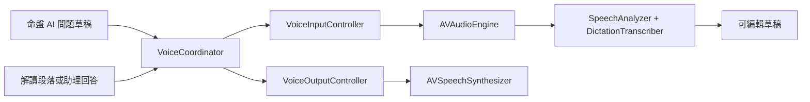

# iOS 語音輸入與語音輸出計畫

狀態：INCOMPLETE（缺少 iOS 26 實機驗證）

## Goal

在 iOS 26 App 內加入可選用的正體中文語音輸入與語音輸出。
語音輸入用於「命盤 AI」問題草稿，辨識結果必須先讓使用者確認，且不得自動送出或產生第三方 API 費用。
語音輸出用於朗讀命盤解讀段落與命盤助理回答，並提供明確的暫停、繼續與停止操作。
鍵盤輸入、文字閱讀、離線基本解讀與既有 AI 流程必須維持可用。

## Context

- App 使用 Swift 6、SwiftUI、Observation 與完整 Strict Concurrency，最低支援 iOS 26.0。
- `apps/ios/project.yml` 是 Xcode project 的 source of truth，修改後必須執行 `xcodegen generate`。
- 自訂語音輸入最適合整合於 `ChartAssistantView` 的 `assistant.composer`，其他文字欄位可繼續使用系統鍵盤聽寫。
- 可朗讀內容目前位於 `InterpretationOverviewView`、`InterpretationCategoryDisclosure` 與 `ConversationTurnView`。
- iOS 26 的 `SpeechAnalyzer` 與 `DictationTranscriber` 可處理非同步語音轉文字，語言資產由 `AssetInventory` 管理。
- iOS 26 尚無可用的 `CaptureInputSequenceProvider`，因此即時麥克風輸入需由 `AVAudioEngine` 產生 buffer，再轉成 `AnalyzerInput` 提供給 `SpeechAnalyzer`。
- `AVSpeechSynthesizer` 可在本機朗讀 `AVSpeechUtterance`，並支援暫停、繼續、停止與 delegate 狀態通知。
- Apple 文件要求語音辨識與麥克風存取具有用途說明，App 應在首次使用語音輸入時才請求權限。
- 目前 repository 沒有語音 framework、麥克風權限說明或語音測試替身。
- 2026-08-25 的基準測試中，54 個單元測試全數通過，前三個 UI tests 通過，但完整 `just test` 在 300 秒工具期限內於最後一個 UI test 執行期間逾時，因此完整 UI baseline 尚未驗證。
- Apple 參考文件：[SpeechAnalyzer](https://developer.apple.com/documentation/speech/speechanalyzer)、[Speech](https://developer.apple.com/documentation/speech)、[Speech recognition permission](https://developer.apple.com/documentation/speech/asking-permission-to-use-speech-recognition)、[AVSpeechSynthesizer](https://developer.apple.com/documentation/avfaudio/avspeechsynthesizer)。

## Architecture

- `VoiceCoordinator` 由 App root 建立並透過 environment 注入，確保全 App 同一時間只有一個錄音或朗讀工作。
- `VoiceInputController` 封裝權限、`zh-TW` locale、語言資產、audio session、麥克風 buffer、逐步辨識結果與停止清理。
- `VoiceOutputController` 封裝 `AVSpeechSynthesizer`、目前內容 ID、播放狀態與 delegate callback。
- framework 邊界以 protocol 包裝，單元與 UI tests 使用可預測的 fake，避免測試依賴真實麥克風、語音資產或喇叭。
- 開始錄音前停止朗讀，開始朗讀前停止錄音，切換畫面或 App 進入背景時結束目前工作並釋放 audio session。

## Tech Stack

- Speech：`SpeechAnalyzer`、`DictationTranscriber`、`AssetInventory`、`AnalyzerInput`。
- AVFAudio：`AVAudioEngine`、`AVAudioApplication`、`AVAudioSession`、`AVSpeechSynthesizer`、`AVSpeechUtterance`。
- SwiftUI、Observation、Swift Concurrency。
- XCTest 與 XCUITest。
- XcodeGen。

## Non-Goals

- 不替出生資料、命盤名稱、API endpoint、model 或 API key 欄位建立自訂語音輸入。
- 不自動送出辨識完成的問題。
- 不自動朗讀新產生的解讀或 AI 回答。
- 不朗讀原始命盤資料、解讀依據、隱私提示或免責說明。
- 不錄製、保存、匯出或分享音訊檔案。
- 不加入第三方 STT、TTS、分析 SDK 或開發者後端。
- 不在本次工作加入自訂語言模型、音色選擇、朗讀速度設定或背景朗讀。
- 不在本次工作上傳 TestFlight 或變更 App Store 售價與 metadata。

## Assumptions

- 語音輸入只需要支援命盤 AI 的問題草稿。
- 語音輸出支援每一個命盤解讀段落與每一則命盤助理回答。
- 預設辨識 locale 與朗讀 voice 使用 `zh-TW`，裝置不支援時顯示可恢復的狀態並保留文字操作。
- 使用者停止辨識時保留已辨識草稿，取消或無法啟動時恢復開始錄音前的草稿。
- 辨識文字沿用問題 500 字上限，達上限時停止接收更多文字、保留合法內容並顯示狀態，不得靜默送出或清空。
- 首次語言資產若需要下載，可使用網路與裝置儲存空間，但問題內容與音訊不會傳送到使用者設定的第三方 AI endpoint。

## Plan

### 1. 建立可測試的語音狀態與邊界

- [x] 定義 `VoiceInputControlling`、`VoiceOutputControlling` 與 UI 所需的 idle、preparing、recording、finalizing、speaking、paused、failed 狀態，並先加入狀態轉換測試；預期結果是 SwiftUI 不直接依賴 Apple concrete class，驗證方式是執行新增的語音 controller 單元測試並確認 Swift 6 concurrency 無警告或錯誤。證據：`VoiceCoordinatorTests` 20 項通過，Release build 沒有 Swift concurrency warning。
- [x] 定義草稿合併規則，區分錄音前文字、已 final 的辨識文字與可被替換的 volatile 文字；預期結果是逐步結果不重複、不覆蓋既有草稿且保持 500 字限制，驗證方式是以 fake result sequence 測試新增、替換、停止、取消、空白與超限案例。證據：`VoiceDraftComposer` 與 `VoiceTranscriptAccumulator` 測試涵蓋替換、final 保護、取消與超限且全數通過；PR 回饋修正後，語音 session 期間的輸入框與建議問題會停用，UI test 驗證使用者無法以鍵盤或建議按鈕產生會被下一筆辨識覆寫的競態。
- [x] 定義朗讀內容 ID 與控制規則，確保同一時間只朗讀一個段落或回答；預期結果是切換內容會先停止舊內容且狀態指向新內容，驗證方式是以 fake synthesizer 驗證呼叫順序與狀態。證據：切換、完成 callback、延遲取消與停止等待中朗讀測試全數通過。

### 2. 設定權限與 Xcode project

- [x] 在 `apps/ios/project.yml` 加入正體中文 `NSMicrophoneUsageDescription` 與 `NSSpeechRecognitionUsageDescription`，內容明確限定為將使用者主動說出的命盤問題轉成可編輯文字；預期結果是 generated Info.plist 含兩個用途說明，驗證方式是執行 `xcodegen generate`、建置 App，再用 `plutil` 檢查 build product 的 Info.plist。證據：Release Info.plist 顯示兩個正體中文用途說明且 `MinimumOSVersion` 為 26.0。
- [x] 重新產生並只保留與 `project.yml` 一致的 Xcode project 變更；預期結果是新語音 source 自動進入 App target 且既有 scheme 設定沒有非預期降版或重寫，驗證方式是檢查 generated project diff 並執行 simulator build。證據：XcodeGen project 包含六個新增 Swift source，scheme 非必要重寫已回復，Debug simulator build 通過。

### 3. 實作 iOS 26 語音輸入服務

- [ ] 在 `apps/ios/MightyZiWei/Platform/Speech/` 實作 `VoiceInputController`，於使用者首次點擊麥克風時依序請求 speech recognition 與 microphone 權限；預期結果是 authorized、denied、restricted 與 not determined 都有明確狀態，驗證方式是 protocol fake 單元測試與實機逐一檢查允許及拒絕流程。
- [ ] 以 `DictationTranscriber.supportedLocale(equivalentTo: Locale(identifier: "zh-TW"))` 檢查支援，並透過 `AssetInventory` 檢查、下載及安裝所需資產；預期結果是已安裝時立即準備、需下載時顯示準備狀態、不支援或下載失敗時可重試且鍵盤仍可用，驗證方式是 fake asset inventory 測試及至少一台實機首次啟用測試。
- [ ] 使用 `AVAudioEngine` 擷取麥克風 buffer，依 analyzer 支援格式轉換後送入 `SpeechAnalyzer` 與 `.progressiveShortDictation` 的 `DictationTranscriber`；預期結果是 `zh-TW` 短句能逐步更新且停止時完成 finalization，驗證方式是 controller 測試確認 input sequence 正常結束，並以實機口述至少三句含「紫微斗數、命宮、三方四正」的問題核對文字可編輯。
- [ ] 完整處理權限拒絕、locale 不支援、資產下載失敗、麥克風 unavailable、audio format 轉換失敗、資源不足、分析錯誤與 task cancellation；預期結果是每條失敗路徑都停止 audio engine、結束 analyzer sequence、釋放 audio session 並保留安全草稿，驗證方式是每一類錯誤都有 fake 單元測試且重試後可重新錄音。
- [ ] 處理來電或系統 audio interruption、route change、畫面離開與 App 進入背景；預期結果是錄音不會在背景或失去麥克風後繼續，且已 final 的草稿保留，驗證方式是狀態測試加上實機中斷與背景切換檢查。

### 4. 將語音輸入整合至命盤 AI composer

- [x] 在 `ChartAssistantView.composer` 加入一個清楚的麥克風按鈕，錄音中改為停止按鈕並顯示可見狀態；預期結果是按鈕不擠掉文字欄位或送出按鈕，且一般、最大 Dynamic Type、Dark Mode 都能操作，驗證方式是 SwiftUI UI test 與人工外觀檢查。證據：語音 UI test 在 Dark Mode 通過，最大 Dynamic Type UI test 確認麥克風與朗讀按鈕可操作。
- [x] 將辨識結果寫入 `assistantStore.draft` 而不呼叫 `send`，保留使用者錄音前的文字並允許鍵盤修改；預期結果是停止錄音後只得到可編輯草稿且不新增對話輪次、不產生第三方 API 請求，驗證方式是 fake speech UI test 檢查 draft、turn count 與 mock answerer invocation count。證據：UI test 確認停止前後草稿更新且 `assistant.answer` 不存在，只有手動點擊送出後才產生回答。
- [x] 在送出、清除對話、切換命盤、達十輪上限、AI request 進行中或 composer disabled 時停止或停用錄音；預期結果是語音狀態與既有對話狀態不互相競爭，驗證方式是針對每個既有狀態執行 controller/UI 測試。證據：既有 AI 狀態 UI tests、語音 draft UI test與 coordinator cancellation regression tests 全數通過；PR 回饋修正後，錄音、準備與 finalizing 期間的送出按鈕會停用，`sendQuestion` 也有防禦性 guard，UI test 驗證部分草稿不會送出。
- [ ] 為錄音、準備、停止、權限拒絕、超限與失敗狀態加入正體中文文字、accessibility label、hint、value 與 announcement；預期結果是 VoiceOver 使用者能知道是否正在收音及如何停止，驗證方式是 Accessibility Inspector 或實機 VoiceOver 檢查並由 UI test 驗證固定 identifier 與主要 label。自動化證據：`VoiceCoordinatorTests` 已驗證準備、收音與結束狀態分別提供正確 label、value 與 enabled 狀態，語音 UI test 已驗證準備與收音狀態；實機 VoiceOver 仍待驗證。

### 5. 實作語音輸出服務

- [x] 實作 `VoiceOutputController` 包裝單一 `AVSpeechSynthesizer`，使用 `zh-TW` voice 與 `AVSpeechUtterance`，並透過 delegate 將開始、暫停、繼續、完成、取消與失敗同步回 observable state；預期結果是 UI 狀態與 synthesizer 一致且不累積失效 queue，驗證方式是 fake synthesizer 單元測試所有 callback 與重複點擊案例。證據：started、paused、resumed、finished、cancelled、failed 與內容切換測試全數通過，stale utterance 以 ObjectIdentifier 隔離。
- [ ] 實作朗讀、暫停、繼續、停止與切換內容操作，並在新朗讀開始前清除舊 utterance；預期結果是一次只有一段聲音且使用者始終可停止，驗證方式是 fake 呼叫順序測試與實機逐項操作。
- [ ] 處理沒有 `zh-TW` voice、空白內容、audio interruption、route change、畫面離開與 App 進入背景；預期結果是無 voice 或音訊中斷時顯示可恢復狀態，不影響文字閱讀，驗證方式是錯誤注入測試與實機背景、耳機或藍牙路由檢查。

### 6. 將朗讀控制整合至解讀與回答

- [x] 在命盤總覽與每個已展開的解讀分類加入一致的「朗讀」控制，朗讀內容只包含段落標題與 `section.content`；預期結果是收合內容不增加第一屏資訊負擔，且不朗讀 evidence、免責說明或隱私文字，驗證方式是 fake output UI test 比對送入文字與目前內容 ID。證據：程式資料流只傳入 title 與 content，UI test 分別啟動總覽與個性分類的 mock 朗讀；PR 回饋修正後，收合正在朗讀的分類仍會在卡片外層保留暫停與停止控制，UI test 已驗證兩個控制可見且可停止。
- [x] 在每個 `ConversationTurnView` 的助理回答加入相同朗讀控制，朗讀內容只包含回答本文；預期結果是使用者可指定單則回答且問題與回答依據不被加入 utterance，驗證方式是 UI test 選取不同回答並比對 fake output 收到的文字。證據：程式資料流只傳入 `turn.answer`，語音 UI test 產生回答後成功啟動與停止該回答朗讀。
- [ ] 朗讀進行時才揭露暫停或繼續與停止操作，並為狀態變化提供 VoiceOver announcement；預期結果是平常介面維持極簡，播放中仍有完整控制與可理解狀態，驗證方式是一般字級、最大 Dynamic Type 與 VoiceOver 人工檢查。
- [ ] 確保開始錄音會停止朗讀、開始朗讀會停止錄音，且導覽離開目前內容時不持續朗讀；預期結果是麥克風不會收進 App 自己的語音，也不會跨畫面失去控制，驗證方式是 coordinator 單元測試及實機快速切換操作。

### 7. 補齊自動化與實機驗證

- [x] 新增語音 permission、asset、transcription、draft merge、字數上限、清理與 audio exclusivity 單元測試；預期結果是所有可確定的成功與失敗路徑不依賴真實硬體，驗證方式是執行 MightyZiWeiTests 並確認新增測試全數通過。證據：`VoiceCoordinatorTests` 20 項通過，涵蓋錯誤訊息、transcript、上限、取消競態、清理、input/output 互斥、分階段無障礙狀態，以及相同格式 audio tap buffer 的獨立副本。
- [x] 新增 mock speech launch argument 與 UI tests，涵蓋「錄音只填草稿不送出」、「停止或取消」、「朗讀、暫停、繼續、停止」、「切換朗讀內容」及主要 accessibility identifier；預期結果是 CI 不觸發系統權限提示或播放聲音，驗證方式是執行 MightyZiWeiUITests 並確認測試全數通過。證據：`-UITestMockSpeech` 不要求權限或播放聲音，語音 UI test 及完整 5 項 UI suite 通過。
- [x] 以 iPhone Simulator 驗證既有首頁、排盤、命盤、基本解讀、AI 多輪問答、Dark Mode 與最大 Dynamic Type 沒有回歸；預期結果是所有既有單元與 UI tests 通過，驗證方式是執行 `cd apps/ios && DEVELOPER_DIR=/Applications/Xcode.app/Contents/Developer just test` 並保存文字結果，不將 `.xcresult` 圖片加入 repository。證據：PR 回饋修正後重新執行 `just test`，74 個單元測試與 5 個 UI tests 全數通過；focused 語音 UI test 亦單獨通過。
- [ ] 以至少一台 iOS 26 實機驗證首次資產準備、允許與拒絕權限、`zh-TW` 辨識、500 字上限、喇叭與耳機或藍牙輸出、來電或音訊中斷、背景切換及重新啟動；預期結果是所有流程可恢復且無音訊檔案被保存，驗證方式是依本項清單逐項記錄裝置、OS 版本與結果。

### 8. 更新產品與隱私文件

- [x] 更新 `PRODUCT.md` 與 `README.md`，說明語音輸入只建立可編輯問題草稿、語音輸出需手動啟動、兩者不改變 AI grounding 或計費邊界；預期結果是產品範圍與實際 UI 一致，驗證方式是逐項對照已完成的行為與文件敘述。證據：文件 diff 已逐項對照 composer 與 playback controls 的實際行為。
- [x] 更新 `docs/PRIVACY.md`，說明麥克風與 speech recognition 權限、語言資產可能下載、App 不保存音訊，以及只有使用者最後主動送出的文字才會傳送至自訂第三方 API；預期結果是沒有不實的完全離線或不傳輸宣稱，驗證方式是對照 Apple framework 實際行為、網路邊界與程式碼路徑審查文件。證據：已對照 SpeechAnalyzer、AssetInventory、麥克風 buffer 與 `assistantStore.send` 的唯一傳送路徑。
- [ ] 更新 `docs/SUPPORT.md`，加入權限拒絕、語言資產無法準備、沒有聲音與 audio route 的排查方式；預期結果是使用者可自行恢復常見問題，驗證方式是依文件在一台實機重走至少一個拒絕權限與一個輸出問題流程。

### 9. 最終整合與安全檢查

- [x] 重新執行 `xcodegen generate`、Debug simulator build、完整測試與 Release generic device build；預期結果是 iOS 26.0 deployment target、Swift 6 strict concurrency 與 signing-independent build 均維持成功，驗證方式是保存四個命令的 exit code 與測試摘要。證據：XcodeGen、Debug、`just test` 與乾淨 Release generic iOS build 均 exit 0；PR 回饋修正後再次完成 74 個單元測試、5 個 UI tests 與乾淨 Release generic iOS build，Release 沒有程式碼 warning。
- [x] 檢查最終 diff，只包含計畫內 Swift、XcodeGen project、測試與正體中文文件，且沒有音訊、圖片、`.xcresult`、secret 或非預期 generated setting 變更；預期結果是 repository 符合檔案傳送與 Git 規則，驗證方式是執行 `git status --short`、`git diff --check`、檔案類型搜尋與逐檔 diff review。證據：`git diff --check` 通過，binary extension 與 secret pattern 搜尋無結果，scheme 生成噪音已回復。
- [x] 將本文件每個已驗證項目附上簡短證據並勾選，任何失敗、跳過或只在 simulator 驗證的項目保持未勾選；預期結果是執行紀錄可追溯，驗證方式是重新閱讀本文件並確認每個勾選項都有命令、測試結果或實機紀錄。證據：所有勾選項均附命令、測試或 inspected artifact；實機相依項目保持未勾選。

## Unknowns

- [ ] iOS 26 實機語音驗證尚未執行；需要一台可連線的 iPhone 才能驗證真實權限 prompt、`zh-TW` 資產、麥克風、喇叭、耳機或藍牙、audio interruption、背景切換與 VoiceOver。
- 2026-08-25 執行 `DEVELOPER_DIR=/Applications/Xcode.app/Contents/Developer xcrun devicectl list devices` 的結果為 `No devices found.`。
- 在取得實機並通過所有未勾選項目前，本計畫不得改為 `DONE`，也不得刪除。

## Risks

- `zh-TW` transcription locale 或所需模型可能因裝置而不可用，UI 必須保留鍵盤輸入並提供可重試錯誤。
- 首次安裝語言資產可能耗時、需要網路或因儲存空間不足失敗，準備狀態不得看起來像正在錄音。
- progressive result 可能修改先前 volatile 文字，若合併規則錯誤會造成重複或覆蓋使用者原有草稿。
- Swift 6 actor isolation、audio tap callback 與 analyzer task 的生命週期若未集中管理，可能造成 data race、懸掛 task 或重複 install tap。
- TTS 與麥克風共用 audio session，若缺少互斥與清理，App 自己的朗讀可能被再次辨識，或其他 App 音訊無法恢復。
- Simulator 與 fake 無法證明真實麥克風、語言資產、權限 prompt、耳機路由或系統中斷正常，因此實機驗證是必要完成條件。

## Rollback / Recovery

- 每完成語音 controller、語音輸入 UI、語音輸出 UI 與文件階段後建立可建置且測試通過的安全檢查點。
- 若 `SpeechAnalyzer` 的 `zh-TW` 實機支援未通過，不降級成第三方雲端辨識，也不影響鍵盤輸入；回復語音輸入 UI 與權限設定，保留獨立且已驗證的本機語音輸出。
- 若朗讀造成無法可靠恢復的 audio session 或導覽問題，回復朗讀 UI 與 output controller，保留文字內容與已驗證的語音輸入。
- 使用者拒絕權限、資產安裝失敗或 audio route 中斷時，只結束目前語音工作，不清除草稿、對話、命盤或 API 設定。
- 回復 generated project 時以 `apps/ios/project.yml` 為準重新產生，不手動保留無法由 XcodeGen 重現的設定。

## Completion Checklist

- [ ] 命盤 AI composer 可用 `zh-TW` 語音建立可編輯草稿，且不會自動送出；驗證方式是 mock UI test 與 iOS 26 實機口述測試均通過。
- [ ] 命盤解讀段落與單則助理回答可手動朗讀、暫停、繼續與停止；驗證方式是 fake output 測試與 iOS 26 實機播放測試均通過。
- [ ] 錄音與朗讀互斥，離開畫面、進入背景、音訊中斷或錯誤後都會清理資源並保留安全文字狀態；驗證方式是 controller 測試與實機生命週期測試均通過。
- [ ] 權限拒絕、locale 不支援、資產下載失敗、麥克風 unavailable、辨識失敗與沒有 voice 都有正體中文可恢復 UI；驗證方式是錯誤注入測試及至少一個實機拒絕權限流程通過。
- [x] 語音輸入遵守 500 字上限，鍵盤輸入、十輪限制、AI cancellation 與問題草稿保存行為沒有回歸；驗證方式是新增單元測試與既有 AI 測試全數通過。證據：上限、草稿與取消 regression tests 通過，完整既有 AI unit/UI tests 通過。
- [ ] 語音控制在 VoiceOver、最大 Dynamic Type、Dark Mode 下可理解且可操作；驗證方式是 UI test 與實機 accessibility audit 通過。
- [x] 用途說明、產品文件、隱私文件與支援文件和實際 framework 行為一致；驗證方式是 generated Info.plist 與四份文件逐項審查通過。證據：Release Info.plist 與 `PRODUCT.md`、`README.md`、`docs/PRIVACY.md`、`docs/SUPPORT.md` 已逐項審查。
- [x] App 未保存音訊、未新增第三方語音服務、未把未送出的草稿傳給 AI endpoint，也未新增二進位產物；驗證方式是程式碼資料流審查、網路 mock assertion 與最終 Git diff 檢查通過。證據：僅使用 Apple framework 與記憶體 buffer，UI test 證明未手動送出前沒有回答，binary 與 secret 搜尋無結果。
- [x] Debug build、Release generic device build、所有單元測試與所有 UI tests 通過；驗證方式是附上最終命令、exit code 與測試摘要。證據：PR 回饋修正後 `just test` exit 0（74 unit、5 UI），focused voice UI test exit 0，乾淨 Release generic iOS build exit 0。
- [ ] 本計畫所有必要 checkbox 均有驗證證據且已勾選後，才將頂端狀態改為 `DONE`；驗證方式是最終逐項稽核沒有未完成、失敗、跳過或未驗證項目。
