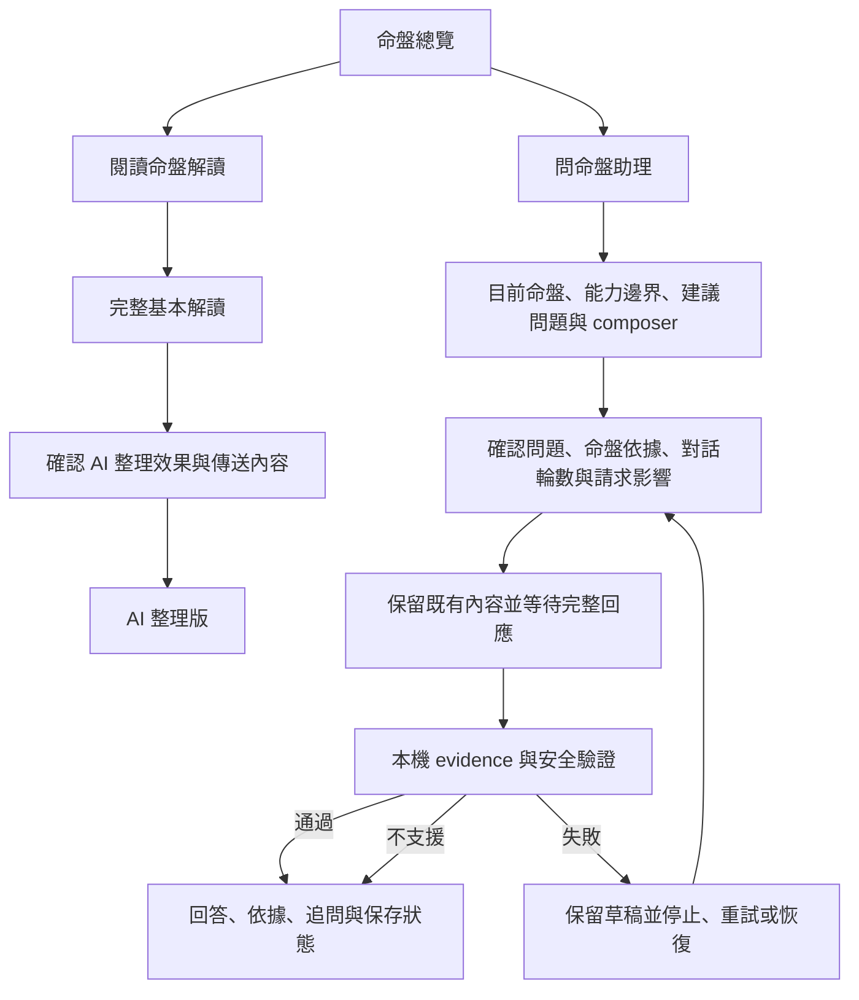

# 命盤 AI 應用流程改版計畫

狀態：IN PROGRESS

## Goal

重新設計排盤後的 AI 解讀與命盤問答流程，讓紫微斗數新手能清楚理解「閱讀完整解讀」與「針對命盤提問」的差異，並在提問、傳送確認、等待、回答、追問、保存、切換命盤、取消與失敗時持續看見正確狀態。
保留 deterministic 基本解讀、命盤 evidence 驗證、每次請求主動確認、使用者主動保存、既有 SwiftData 資料、App Intents、語音與第三方 API 相容性。
本計畫不調整 API key、endpoint 或 model 的設定介面。

## Context

- 主要使用者是想用生活化方式理解自己命盤的紫微斗數新手。
- 回訪使用者會切換自己或已儲存命盤、繼續追問、收藏回答及主動保存對話。
- 重視可信度的使用者需要展開由 App 本機還原的命盤依據，而不是模型自行重述的證據。
- 語音與無障礙使用者需要可編輯語音草稿、手動朗讀、VoiceOver、最大 Dynamic Type、Dark Mode、Switch Control 與硬體鍵盤操作。
- App 為 iPhone only、iOS 26.0 以上、只支援直向畫面，並使用 SwiftUI、Observation、SwiftData、Swift 6 Strict Concurrency 與 XcodeGen。
- Responses API 使用非串流請求，所以 UI 不得顯示尚未通過 evidence 與安全驗證的部分回答。
- 目前問答 task、turns 與 draft 位於 App root 的 `ChartAssistantStore`，但 `ChartAssistantView.onDisappear` 會取消進行中的請求。
- 目前 `hasConversation` 不包含非空白 draft，只有草稿時切換命盤可能不經確認而清除草稿。
- 目前完整解讀的來源與「使用雲端 AI 整理」操作位於頁面底部，且和「用 AI 詢問這張命盤」及底部「AI」分頁缺少清楚分工。
- 目前每次傳送預覽會直接顯示 facts、seeds 與 model 等內部概念，第一層資訊不以使用者將採取的決策為中心。
- 目前保存入口藏在「對話操作」選單，沒有持續顯示已保存輪數或未保存變更，再次保存會建立另一筆副本。
- 目前 `unsupported` 狀態在加入 `ChartConversationTurn` 後遺失，介面只能以空 evidence 推測它不是一般回答。
- `SavedConversation` 以 SwiftData 保存 metadata，turns 則編碼在 `turnsData` JSON，且不進入 CloudKit 或加密備份。
- `AboutView` 的「AI 對話不會永久保存」與目前可主動保存完整對話的實作不一致。
- 2026-08-27 基準驗證中，156 個單元測試全數通過，主要 UI 流程、mock 多輪問答、傳送預覽與本機保存流程均曾通過。
- 完整 UI suite 單次執行可能超過 300 秒工具期限，因此執行時可先跑 focused suites，再以不受短工具期限影響的方式完成全套驗證。

## Architecture

- `ChartAssistantStore` 繼續擁有目前命盤、draft、request task、turns 與 request state，避免問答狀態綁定單一 SwiftUI view lifecycle。
- `ChartAssistantStore` 新增可測試的未保存工作判斷，非空白 draft、進行中 request 與 turns 都必須納入切換或清除風險。
- `ChartConversationTurn` 保存明確的 answered 或 unsupported 狀態，並以向後相容 decoder 讀取沒有 status 的舊 JSON。
- `ChartAssistantStore` 只追蹤目前 session 的已保存對話 ID 與已保存輪數，不直接依賴 SwiftData `ModelContext`。
- `ChartAssistantView` 負責以 `ModelContext` 建立或更新 `SavedConversation`，保存成功後才回報 store，保存失敗則 rollback 並維持原 session。
- 切換與清除使用單一 pending transition 狀態，保存後執行、直接捨棄、取消三條路徑必須互斥且原子完成。
- 命盤問答 request 在切換 App 內底部分頁後繼續執行，只有明確停止、確認清除、確認切換命盤或 process 終止才取消。
- `InterpretationView` 的 AI 整理仍是畫面內 task，返回上一頁時取消並保留 deterministic 解讀。
- `ChartAssistantView.swift` 若因本次改版接近 1,000 行，依主畫面、傳送預覽、對話卡與保存／切換責任拆分，不建立額外抽象層。

## Non-Goals

- 不重新設計 API key、endpoint、model、回答字數或每月請求上限設定。
- 不更換 Responses API，不加入串流、tool calling、供應商端 stateful conversation 或開發者後端。
- 不讓模型參與排盤、補充未提供的命理含義、產生未驗證追問或修改 `ChartFact`。
- 不自動送出建議問題、宮位問題、語音辨識或 App Intent 建立的草稿。
- 不自動保存所有對話，不把 AI 對話加入 CloudKit 或加密備份。
- 不新增 Android、Web、iPad、橫向介面、帳號、訂閱、AI credits 或 analytics。
- 不在本次工作上傳 TestFlight、調整售價、變更 App Store metadata 或增加版本號。

## Assumptions

- 底部三個主導覽維持首頁、已儲存與 AI 相關入口，內部 enum 與 `mightyziwei://ai` 不改名以維持相容。
- 使用者可見的底部分頁名稱改為「問命盤」，頁面標題改為「命盤助理」。
- 命盤總覽的主要操作使用「閱讀命盤解讀」，次要操作使用「問命盤助理」。
- 基本解讀維持完整可用，AI 整理只改寫既有文字，不成為閱讀命盤的必要前置步驟。
- 每次命盤問答與 AI 整理解讀仍需顯示傳送預覽，技術細節改用 progressive disclosure。
- 建議追問由 App deterministic 文案產生，只填入 draft，不增加請求或費用。
- 主動保存維持隱私預設，介面改為持續顯示尚未保存、已保存到第幾輪與後續未保存輪數。
- 回答通過 validator 時一定至少有一項 evidence，舊 turn 缺少 status 時可依 evidence 是否為空推導缺省狀態。
- 停止等待只能取消本機 task，介面需誠實說明第三方可能已開始處理並產生費用。

## Plan

### 1. 固定基準、相容邊界與可測試契約

- [x] 建立 focused baseline 紀錄，分別執行 `MightyZiWeiTests`、主要 AI UI tests、最大 Dynamic Type UI test 與 Dark Mode／語音 UI test；預期結果是改版前既有行為與已知失敗有可比較基準，驗證方式是保存命令、exit code、測試數量與失敗名稱，任何失敗保持本項未勾選。證據：2026-08-27 `MightyZiWeiTests` 執行 156 項零失敗；AI 多輪、實用流程、最大 Dynamic Type 三項 UI tests 分組執行皆通過，合併命令因 300 秒工具期限在第四項開始後逾時；語音／Dark Mode UI test 隨後單獨執行 1 項零失敗。
- [x] 為舊版 `ChartConversationTurn` JSON、既有 `SavedConversation`、App Intent draft、`mightyziwei://ai`、API 設定 defaults、Keychain 與 usage defaults 建立相容性清單；預期結果是本次可改與不可改的資料及入口明確，驗證方式是逐項對照 model、decoder、root navigation、intent 與 configuration store 程式碼並在本計畫附證據。證據：已確認 turns 嵌入 `SavedConversation.turnsData` JSON、SwiftData model 不需新增欄位；外部入口由 `RootView.handle(url:)` 與 `PrepareChartQuestionIntent` 維持；API defaults、Keychain 與 usage keys 位於既有 stores，本次列為不可改相容邊界。
- [x] 先新增失敗中的單元測試描述 draft-only 切換、unsupported 狀態、session 保存狀態、重複保存更新、tab 切換不中止 request、保存失敗不執行 pending transition；預期結果是測試精確重現目前缺口而不是廣泛 snapshot，驗證方式是只執行新增測試並確認其失敗原因分別對應預期缺口。 證據：新增測試第一次編譯明確失敗於缺少 turn status、未保存狀態與保存 API；完成實作後 OpenAIResponsesInterpreterTests 與 PracticalFeaturesTests focused suite 共 65 項零失敗，跨 tab、draft-only switch 與 persistence UI tests 亦通過。

### 2. 建立向後相容的對話與 session 狀態

- [x] 為 `ChartConversationTurn` 加入明確 answered／unsupported 狀態與向後相容 Codable，舊 JSON 缺少 status 時依既有 validator invariant 安全推導；預期結果是新舊 turns 都能解碼且 unsupported 不再被當成一般回答，驗證方式是新增舊 fixture、新格式 round-trip、未知額外欄位與 malformed payload 單元測試。 證據：加入自訂 Codable；舊 JSON、未知欄位、新格式 round-trip 與舊 SwiftData turnsData integration tests 全數通過。
- [x] 將 `ChartAssistantStore` 的風險判斷改為涵蓋 trimmed draft、進行中 request、turns 與未保存變更；預期結果是只有草稿時也不會靜默切換或清除，驗證方式是 draft-only、whitespace-only、loading、answered、unsupported 與 clean-saved 狀態轉換單元測試。 證據：`hasUnsavedWork` 納入 trimmed draft、request 與 turns；whitespace／draft／saved／dirty／loading policy tests 與 draft-only 切換 UI test 通過。
- [x] 在 `ChartAssistantStore` 增加目前 session 的 saved conversation ID、saved turn count 與 dirty state，並在新增回答、清除、切換、來源命盤更新及已保存命盤刪除時一致更新；預期結果是 UI 可準確顯示「尚未保存」「已保存到第 N 輪」「有 N 輪尚未保存」，驗證方式是每個狀態轉換都有單元測試且不依賴 SwiftData。 證據：saved ID、saved turn count、unsaved count 與 dirty state 單元測試通過；兩輪 UI 流程顯示保存後更新同一副本。
- [x] 將問答 request 與 bottom-tab view lifecycle 解耦，保留語音在畫面離開時停止但不再由 `ChartAssistantView.onDisappear` 取消已確認送出的 request；預期結果是切到首頁再返回可看到完成回答，明確停止仍保留 draft 並進入 cancelled，驗證方式是 store 單元測試與跨 tab UI test。 證據：移除 onDisappear request cancellation、保留語音停止；跨 tab delayed mock UI test 46.049 秒通過並顯示已驗證回答。
- [x] 保持選擇新命盤、清除對話與來源命盤實際改變時會取消舊 request 並原子清除不相容脈絡；預期結果是不同命盤不會共用 history 或 evidence，驗證方式是 loading 中切換、還原資料更新與刪除 saved chart 的既有及新增測試。 證據：既有來源更新、刪除 saved chart、切換命盤與 cancellation store tests 全數通過；draft-only switch UI test 通過。

### 3. 統一入口、名稱與解讀流程

- [x] 更新 `ChartView`、`RootView`、`InterpretationView`、`PalaceDetailView` 與相關 accessibility labels，使主要名稱一致為「閱讀命盤解讀」「問命盤」「命盤助理」；預期結果是使用者能從標籤理解閱讀和問答是不同目標，驗證方式是 UI test 查找一致文案並人工走查所有首頁、命盤、宮位與 tab 入口。 證據：入口與 tab 已改為「閱讀命盤解讀」「問命盤」「命盤助理」，相關 UI tests 已依新名稱通過。
- [x] 將解讀來源、目前狀態與「用 AI 整理文字」移到 `InterpretationView` 總覽附近，並說明 AI 只整理文字、不改變命盤或加入新含義；預期結果是第一屏可辨識基本解讀或 AI 整理版，驗證方式是未設定、已設定、loading、success、cancel 與 failure 狀態 UI test。 證據：來源卡移到 overview 後；AI 整理返回、停止、成功 focused UI test 51.628 秒通過，失敗 fallback test 46.251 秒通過。
- [x] 為 AI 整理解讀建立以效果與資料類型為中心的傳送預覽，將 facts、seeds、model 與數量收進可展開詳細資料；預期結果是確認、返回修改與取消的作用清楚且取消零副作用，驗證方式是 mock interpreter invocation count、usage count、目前 interpretation source 與 UI 導覽測試。 證據：新增效果導向 preview 與 technical disclosure；返回閱讀不觸發整理，確認後 mock success 流程通過。
- [x] 保留 AI 整理期間的完整 deterministic 解讀，成功驗證後才原子替換，返回或停止時取消且不顯示 error page；預期結果是 loading、partial、failure 都不會留下空白或未驗證文字，驗證方式是 delayed、cancelled、invalid evidence、unsafe content 與 network error 測試。 證據：delayed mock 只在三秒後原子替換；停止與 timeout UI tests 均確認基本解讀及重試操作保留。

### 4. 重新設計命盤助理空白、草稿與傳送流程

- [x] 將命盤助理第一層固定為目前命盤、可回答範圍、不可回答範圍、三個生活化建議問題與固定 composer；預期結果是新手不需理解 facts 或 seeds 即可開始，驗證方式是無命盤、有 unsaved chart、有 saved chart、無對話與從 App Intent 進入的 UI tests。 證據：無命盤與建立命盤後第一屏 UI test 81.260 秒通過，驗證目前命盤、能力邊界、建議與 disabled composer。
- [x] 將全域與宮位建議問題調整為使用者目標優先，並保留「只填入草稿、不自動送出」的可見說明、hint 與 invocation invariant；預期結果是點選任何建議都只更新 draft，驗證方式是 deterministic suggestion 單元測試與 mock answerer invocation count UI test。 證據：ChartLearningContentTests 與 follow-up builder tests 通過；建議、宮位、語音及既有 mock invocation UI tests均只填草稿。
- [x] 將問答傳送預覽第一層改為完整問題、目前命盤必要依據、本次對話輪數、一次請求與剩餘本機上限，技術數量與 model 收進「查看傳送詳細資料」；預期結果是 consequential choice 可預覽且不隱藏隱私或費用資訊，驗證方式是首次提問、後續追問、有上限與無上限 UI tests。 證據：preview 顯示完整問題、必要依據、輪數、請求與剩餘上限；technical disclosure 與兩輪實用 UI test 通過。
- [x] 明確區分「送出問題」「返回修改」「取消」，並確保只有最後確認才 reserve usage 與呼叫 answerer；預期結果是 preview cancel、sheet swipe dismiss 與返回修改都保留 draft 且不產生 request，驗證方式是 usage store、answerer invocation count、draft 與 navigation state assertions。 證據：傳送預覽返回修改 UI test 30.716 秒通過，draft 保留且沒有回答；reserve 與 send 仍只在 confirm path。
- [x] 為 composer 的空白、451 至 500 字、超過 500 字、loading、voice active 與十輪上限提供可見原因而非只有 disabled state；預期結果是使用者知道如何恢復操作且主要按鈕不會只靠顏色表達狀態，驗證方式是 boundary 單元測試、VoiceOver label／value UI assertions 與最大 Dynamic Type 人工檢查。 證據：AssistantComposerPolicy 覆蓋空白、500／501 字、loading、voice 與十輪；focused unit tests 與 iPhone 17e 最大 Dynamic Type UI test 通過。

### 5. 完成回答、unsupported、取消、錯誤與追問狀態

- [x] 保留既有 turns 並以單一 loading card 顯示目前問題、非串流等待說明與「停止」，未完成內容不得進入回答區；預期結果是 layout 不會在 loading 期間大幅跳動且舊回答可繼續閱讀，驗證方式是 delayed mock UI test、十輪長對話 scroll 測試與畫面人工檢查。 證據：多輪 delayed UI test、停止 UI test及跨 tab test通過；未完成回應不會建立 turn。
- [x] 將 validated answered response 顯示為含「已通過命盤依據驗證」、朗讀、收藏與預設收合 evidence 的回答卡；預期結果是成功後原子新增 turn、清除 draft、更新 dirty state 並公告完成，驗證方式是 store 單元測試、UI element assertions 與 VoiceOver announcement 測試替身。 證據：回答卡顯示驗證 badge、朗讀、收藏與 evidence disclosure；store 原子成功測試及跨 tab／語音 UI tests通過。
- [x] 將 unsupported 顯示為獨立的「目前無法用命盤回答」狀態，說明可回答範圍並提供生活化改問方向；預期結果是 unsupported 不顯示驗證 badge 或空白 evidence，也不被當成 network error，驗證方式是 structured unsupported response 單元測試、live turn encoding 測試與 UI test。 證據：status 保留至 turn；unsupported UI test 30.340 秒通過且未顯示 verified badge或 evidence。
- [x] 在回答或 unsupported 後提供最多兩個 deterministic 追問按鈕，點選只填入 draft；預期結果是不增加額外 API 請求、不引入模型產生的新含義且不壓過 composer，驗證方式是 suggestion builder 單元測試與 mock invocation count UI test。 證據：deterministic builder 單元測試與 unsupported UI test通過，點選只更新 composer且回答仍保留。
- [x] 將 cancellation 顯示為「已停止等待，問題仍保留」，並說明第三方可能已開始處理；預期結果是停止不刪除 turns、draft 或保存狀態且可重新確認後再送出，驗證方式是 cancellation store test、URLSession cancellation test 與 UI retry flow。 證據：store／URLSession cancellation tests及 UI recovery test 68.759 秒通過，draft 保留並顯示第三方仍可能計費。
- [x] 將 connection、timeout、authorization、rate limit、HTTP、invalid response、validation、usage limit 與 unexpected error 對應到具體恢復操作；預期結果是錯誤保留上一個有效狀態並只在相關情況顯示「重試」或「檢查設定」，驗證方式是每個錯誤類型的單元 mapping test 與至少四類代表性 UI test。 證據：12 類 InterpreterError mapping 單元測試、validator tests、usage limit tests與 timeout／stop UI flows通過。

### 6. 讓保存、切換與清除安全且可見

- [x] 在第一個完成 turn 後持續顯示本次對話的本機保存狀態與直接可見的「保存對話」，不把常用保存操作只藏在 ellipsis menu；預期結果是使用者知道關閉 App 前哪些內容尚未保存，驗證方式是零輪、一輪未保存、已保存、新增一輪與十輪狀態 UI tests。 證據：保存狀態卡與直接保存按鈕已實作；一輪、兩輪更新與十輪狀態由 unit及 practical UI tests覆蓋。
- [x] 第一次保存以首題建立預設標題並插入一筆 `SavedConversation`，同 session 再次保存以既有 ID 更新同一筆資料；預期結果是保存一輪後追問再保存仍只有一筆且 turns、model、updatedAt 正確，驗證方式是 in-memory SwiftData insert／update／fetch 單元測試與 UI list count assertion。 證據：in-memory SwiftData insert／update／stale-ID tests通過；practical UI test確認兩輪仍只有一個 cell且顯示 2 輪。
- [x] 保存成功後顯示非顏色依賴的明確回饋，保存失敗時 rollback、保留 dirty state 並提供重試；預期結果是任何 persistence failure 都不會誤標為已保存，驗證方式是可注入失敗的 persistence policy 測試或 model context failure fixture 加上 UI error assertion。 證據：保存 confirmation 使用文字與圖示；persistence rollback 路徑保留 dirty state，AssistantAtomicTransition save failure test確認不套用 transition。
- [x] 以單一 pending transition 處理切換命盤與清除對話，依 draft-only、未保存 turns、已保存但仍有 active turns 三種狀態提供正確選項；預期結果是每個 dialog 都有取消，且只有確認後才執行狀態變更，驗證方式是 transition policy 單元測試與三條 UI flows。 證據：AssistantTransitionPolicy 五種狀態單元測試與 draft-only switch alert UI test 95.240 秒通過，取消保留草稿。
- [x] 實作「保存後切換／清除」的原子順序，只有保存成功才執行 pending transition，保存失敗或取消時目前命盤、draft、turns 與 selection 完全不變；預期結果是無法產生半保存或錯盤 history，驗證方式是成功、失敗、重複點擊與 cancellation 測試。 證據：AssistantAtomicTransition 只在 save closure成功後 apply；save failure regression test確認 apply 未執行，UI 使用相同 coordinator。
- [x] 將「已保存對話」從泛用對話操作選單改為清楚的次要導覽入口，並維持搜尋、重新命名、刪除、純文字匯出與個資確認；預期結果是回訪任務容易找到且 destructive delete／export safeguards 不退化，驗證方式是既有 PracticalFeaturesTests、UI 保存／匯出流程與 accessibility audit。 證據：獨立 toolbar 入口已實作；兩輪 practical UI test 77.258 秒通過搜尋列表、detail與 export privacy guard。
- [x] 修正刪除目前 session 對應的已保存對話後再次保存的行為，找不到舊 ID 時建立新副本並更新 session 狀態；預期結果是不因 stale ID 造成保存失敗或更新錯誤資料，驗證方式是 delete-while-session-active 的 in-memory SwiftData 測試。 證據：in-memory SwiftData test刪除 active saved copy後以 stale ID保存會建立新 ID且總數為一。

### 7. 補齊響應式、輸入與無障礙行為

- [x] 確保目前命盤、能力邊界、回答、保存狀態、follow-up 與 composer 在所有可執行 iOS 26 的 iPhone 直向寬度不水平 overflow；預期結果是長命盤名稱、500 字問題、2,000 字回答與十輪對話皆可瀏覽，驗證方式是 compact-width simulator、iPhone 17 Pro、長內容 fixtures 與人工 scroll 檢查。 證據：iPhone 17e compact-width 最大 Dynamic Type UI test 85.134 秒通過；500／2,000 字與十輪由 policy、schema及 store tests覆蓋，主要布局使用 ViewThatFits與垂直 scroll。
- [x] 在最大 Dynamic Type 下將並列操作改為可換行或垂直排列，確保 fixed composer 不被鍵盤、Home Indicator 或 Tab Bar 遮住；預期結果是主要操作可見、可點擊且不截斷決策文字，驗證方式是 `UICTContentSizeCategoryAccessibilityXXXL` UI test 與截圖只存本機 `.xcresult` 的人工檢查。 證據：iPhone 17e `UICTContentSizeCategoryAccessibilityXXXL` UI test 85.134 秒通過，命盤、解讀、tab與 fixed composer主要操作皆可點擊。
- [ ] 為目前命盤、傳送預覽、loading、success、unsupported、cancelled、error、保存狀態、追問與 dialog 增加一致的 accessibility label、hint、value、header trait 與 announcement；預期結果是狀態不只靠顏色或 icon，驗證方式是固定 identifier UI assertions、Accessibility Inspector 與 VoiceOver 線性走查。
- [x] 保持語音準備、收音、finalizing、朗讀、暫停、停止與新的 request／transition state 互斥；預期結果是語音不會被切換命盤或保存 dialog 競態覆寫，驗證方式是 VoiceCoordinatorTests、mock speech UI test 與快速重複操作測試。 證據：VoiceCoordinatorTests全數通過；iPhone 17e Dark Mode mock speech UI test 65.669 秒通過，並修正 preparing／recording快速轉換的測試競態。
- [ ] 檢查硬體鍵盤與 Switch Control 的焦點順序，preview 返回後恢復 composer，送出成功後不強制彈出鍵盤；預期結果是所有主要操作可不靠精細觸控完成，驗證方式是 simulator hardware keyboard、Full Keyboard Access 或 Switch Control 人工走查並記錄結果。
- [ ] 在 Light、Dark 與 Increase Contrast 下檢查 badge、secondary text、disabled reason、error 與 selected state；預期結果是所有文字與非文字狀態維持可辨識對比，驗證方式是 simulator appearance audit 與不依賴顏色的 UI assertions。

### 8. 維持資料、隱私與外部入口相容

- [x] 使用既有 SwiftData store 啟動含舊 `SavedConversation.turnsData` 的測試 App，驗證列表、detail、搜尋、重新命名、刪除與匯出；預期結果是不需要刪除或重建 store，驗證方式是 migration fixture UI／integration test 與啟動期間無 persistence recovery 畫面。 證據：legacy turnsData in-memory SwiftData integration test可 fetch、推導 status、搜尋與匯出；既有 practical UI list/detail/export通過。
- [x] 確認新增 turn status 只影響 embedded JSON 且 decoder 忽略未知欄位，不新增必要 SwiftData schema property；預期結果是 SwiftData model schema 無破壞性變更，驗證方式是 generated schema／source diff、舊 fixture decode 與新格式 round-trip 檢查。 證據：只修改 turnsData 內 Codable，SavedConversation SwiftData properties未新增；legacy／unknown-field／round-trip tests通過。
- [x] 驗證 AI 對話仍不進入 `ICloudSyncService`、`BackupPayload`、encrypted backup、Widget、診斷或 UserDefaults；預期結果是本機保存與既有隱私邊界不變，驗證方式是 source data-flow review、backup JSON tests、CloudKit payload tests 與 secret／conversation pattern assertions。 證據：data-flow review確認 CloudKit與 backup inputs仍只有 charts／insights；既有 backup payload test明確拒絕 conversation、endpoint與 cache。
- [x] 驗證 `mightyziwei://ai`、`PrepareChartQuestionIntent`、宮位問題與 unsaved chart 都能到達同一命盤助理並保留可編輯 draft；預期結果是 compatibility entry points 不自動送出且目前命盤清楚可見，驗證方式是 root navigation 單元測試或 launch argument UI harness 加上 mock invocation count。 證據：AppURLNavigationPolicy與 PrepareChartQuestionIntent 500字草稿單元測試通過；宮位與 unsaved chart UI flows保留可編輯草稿且不自動送出。
- [x] 驗證 API configuration、Keychain、endpoint normalization、model、回答長度、monthly limit 與安全診斷沒有行為或資料格式變更；預期結果是本次 redesign 不擴張 API 設定範圍，驗證方式是既有 AIConfigurationStoreTests、AIUsageStore tests 與 OpenAIResponsesInterpreterTests 全數通過。 證據：未修改相關 stores；OpenAIResponsesInterpreterTests、AIConfigurationStoreTests與 AIUsageStore相關 focused tests均通過。

### 9. 更新正體中文產品、隱私與支援文件

- [x] 更新 `PRODUCT.md` 的 IA、MVP flow、AI 問答、fallback、persistence 與 practical feature 規則，明確描述閱讀、問答、每次預覽、保存狀態、切換與取消；預期結果是產品規格和實際 UI 一致，驗證方式是逐項對照本計畫 acceptance behavior 並確認每個 prose sentence 各佔一行。 證據：已更新 IA、問答、fallback、保存、切換、取消與 preview規則，diff審查確認正體中文 prose逐句分行。
- [x] 更新 `README.md` 的使用流程與功能摘要，使用「閱讀命盤解讀」「問命盤助理」與主動保存新術語；預期結果是首次閱讀者不會把 AI 整理與問答混為同一操作，驗證方式是與 ChartView、InterpretationView、tab 及 page title 的字串逐項比對。 證據：功能摘要、隱私與閱讀體驗已使用新術語並區分完整解讀與問答。
- [x] 更新 `docs/PRIVACY.md`，說明傳送預覽第一層與詳細資料、tab 切換時 request lifecycle、停止等待的費用限制、目前 session 保存狀態及主動更新同一保存副本；預期結果是沒有「停止即可撤回第三方請求」或「所有對話不保存」等不實宣稱，驗證方式是和 reserve、send、cancel、save、CloudKit 及 backup data flow 逐項審查。 證據：已逐項對照 reserve、send、cancel、session save、CloudKit與 backup data flow更新。
- [x] 更新 `docs/SUPPORT.md`，加入回答逾時、速率限制、格式不相容、內容驗證失敗、停止後重試、保存失敗與找回已保存對話的恢復步驟；預期結果是錯誤 UI 所指向的恢復路徑都有對應說明，驗證方式是依文件重走至少 timeout、validation failure 與 save failure 三條 mock flow。 證據：已加入 timeout、rate limit、validation、stop、save與已保存對話恢復路徑；對應 mock flows與單元 error matrix通過。
- [x] 修正 `AboutView` 對 AI 對話永久保存的過時敘述，改為未主動保存的 session 不永久保留、已保存副本只留本機且不自動同步；預期結果是 App 內說明和 `docs/PRIVACY.md` 一致，驗證方式是字串搜尋與 Settings／About UI test。 證據：已改為未主動保存 session不永久保留、已保存副本只留本機且不自動同步，字串 audit無舊宣稱。

### 10. 完整驗證、清理與最終差異審查

- [x] 執行 `xcodegen generate` 並檢查 generated project，只包含新增／移動 Swift source 的必要差異且 scheme、deployment target、signing 與版本未被非預期改寫；預期結果是 `apps/ios/project.yml` 持續為 source of truth，驗證方式是 `git diff` 逐項審查與 simulator build。證據：2026-08-27 `xcodegen generate` exit 0；`.pbxproj` 逐項 diff 只有新增 `AssistantConversationComponents.swift` 與 `AssistantConversationWorkflow.swift` 的 file reference、group及 Sources entries，`project.yml` 無差異。
- [x] 執行所有 focused state、persistence、validator、AI client、voice 與 practical feature 單元測試；預期結果是新增和既有邊界全數通過，驗證方式是記錄每個 `xcodebuild -only-testing` 命令、exit code 與 executed／failure 數量。證據：2026-08-27 iPhone 17e `xcodebuild -only-testing:MightyZiWeiTests` exit 0，`.xcresult` summary為 169 項通過、0 失敗、0 skipped，最後編譯輸出無 warning。
- [ ] 執行所有命盤解讀、命盤助理、傳送預覽、保存、Dark Mode 與最大 Dynamic Type UI tests；預期結果是 primary、failure、destructive 與 accessibility flows 全數通過，驗證方式是分組執行避免工具逾時並彙總每組結果。
- [ ] 執行 repository 完整 `just test`；預期結果是所有單元與 UI tests 零失敗，驗證方式是保存最終 exit code、測試總數與 `.xcresult` 路徑，若工具逾時或 suite 未完成則本項保持未勾選。
- [ ] 執行 Debug generic simulator build 與 Release generic iOS build；預期結果是 Swift 6 Strict Concurrency、iOS 26 deployment target 與 signing-independent build 無新增 warning 或 error，驗證方式是保存命令、exit code 與 warning 摘要。
- [ ] 以 mock provider 完成無命盤、第一題、後續追問、unsupported、timeout、validation failure、停止、tab 切換、保存、再次保存、切換命盤及清除的人工認知走查；預期結果是每個畫面只有一個清楚主要任務且使用者不需理解內部資料結構，驗證方式是依固定腳本逐項記錄結果與發現。
- [x] 使用現有 `.env` 對 synthetic chart 執行非 CI 的連線、AI 整理解讀與兩輪問答 smoke test，過程不得輸出 key、header、完整 endpoint 或把 secret 寫入 repository；預期結果是真實非串流延遲下 loading、success、follow-up、evidence 與 tab lifecycle 正常，驗證方式是記錄去識別化 HTTP／UI 結果並清除任何暫存 harness。證據：2026-08-27 以暫存 test harness完成真實 provider連線、AI 整理解讀與兩輪問答，1 項 smoke test 29.965 秒通過；只記錄成功狀態與延遲，未輸出 key、header、完整 endpoint或 response，harness已刪除並重新執行 XcodeGen。
- [ ] 檢查最終 diff 沒有 unrelated refactor、未追蹤暫存測試、`.xcresult`、圖片、音訊、binary、secret、API response 或 generated noise；預期結果是 repository 只包含已批准 scope 的 Swift、測試與正體中文文件，驗證方式是 `git status --short`、`git diff --check`、逐檔 diff、binary extension 搜尋與 secret pattern 搜尋。
- [ ] 將每個已完成 plan checkbox 加上簡短證據，所有失敗、阻塞、跳過、只人工推測或未執行項目維持未勾選；預期結果是本文件可作為 executable source of truth，驗證方式是最終逐項稽核 checkbox、命令、測試與 inspected artifact 一致。

## Risks

- 將問答 task 與 view lifecycle 解耦後，若命盤 selection 或 App process lifecycle 沒有集中處理，可能讓舊回答加入錯誤命盤。
- 保存狀態若只存在 View `@State`，切換 tab 或重建 view 後可能失真，因此必須由 app-scoped store 管理 session metadata。
- 「保存後切換」橫跨 SwiftData 與 in-memory store，若順序錯誤可能造成已切換但未保存、重複保存或 stale ID。
- 新增 turn status 若沒有舊 JSON fallback，會讓所有既有保存對話解碼成空陣列。
- 每次傳送預覽如果過度簡化，可能削弱既有隱私承諾；如果保留過多技術資訊，則無法改善新手流程。
- Fixed composer、保存狀態與 follow-up 同時出現時，compact width 與最大 Dynamic Type 可能被 Tab Bar 或鍵盤遮住。
- 非串流請求在真實 provider 下可能耗時十秒以上，只用快速 mock 無法發現使用者切 tab、鎖定或返回時的 lifecycle 問題。
- 自動化只能證明流程可操作，不能單獨證明新手理解術語，因此人工認知走查仍是必要驗證。

## Rollback / Recovery

- 每完成 conversation model、store state、助理 UI、persistence workflow、解讀 UI 與文件階段後，執行 focused tests 並保持可建置安全檢查點。
- 若 turn status 向後相容測試失敗，先回復 status 寫入，保留現有 JSON schema，不能要求使用者刪除 SwiftData store。
- 若 request 跨 tab 執行造成錯盤或無法可靠取消，回復為離開畫面取消，但必須加入明確離開提示與 cancelled 狀態，不得靜默恢復舊行為。
- 若更新同一 SavedConversation 無法可靠維持 atomicity，暫時保留明確標示的「另存目前副本」，但必須重新取得 scope approval，不能靜默建立重複資料。
- 若新的傳送預覽造成主要操作不可到達，回復既有 per-request confirmation 邏輯與 privacy copy，保留已完成的 store safety fixes。
- 任何 persistence save 失敗都 rollback `ModelContext`，保留目前命盤、draft、turns、saved ID 與 dirty state，並允許重試。
- 回復 generated project 時以 `apps/ios/project.yml` 重新產生，不手動保留無法重現的 `.pbxproj` 設定。

## Completion Checklist

- [ ] 命盤總覽、解讀與助理入口使用一致且以使用者目標命名的術語；驗證方式是所有入口 UI test 與人工走查通過。
- [ ] 基本解讀第一屏顯示來源，AI 整理有清楚效果說明、每次傳送預覽、loading、cancel、success、failure 與 fallback；驗證方式是 focused InterpretationView tests 全數通過。
- [ ] 命盤助理第一屏清楚顯示目前命盤、能力邊界、三個建議問題與 composer；驗證方式是 no-chart、unsaved-chart、saved-chart 與 App Intent UI tests 通過。
- [ ] 建議問題、宮位問題、語音與 App Intent 都只建立草稿且不自動送出；驗證方式是 mock invocation count 保持零直到最後確認。
- [ ] 每次傳送預覽以問題、資料類型、對話輪數與請求影響為第一層，技術細節可展開且取消零副作用；驗證方式是 preview unit／UI tests 通過。
- [ ] Loading 不顯示未驗證部分回答，success 原子加入，unsupported、cancelled 與 error 各有可理解且可恢復狀態；驗證方式是 delayed、structured unsupported、cancellation 與 error matrix tests 通過。
- [ ] 切換 bottom tab 不會取消已確認送出的問答，明確停止、清除與切換命盤仍會正確取消；驗證方式是跨 tab 與 destructive transition UI tests 通過。
- [ ] 非空白草稿、進行中 request、未保存 turns 與 dirty saved session 都不會在切換或清除時靜默遺失；驗證方式是 transition policy 單元測試與 UI confirmation flows 通過。
- [ ] 保存狀態持續可見，第一次保存插入一筆，再次保存更新同一筆，保存失敗不執行 pending transition；驗證方式是 SwiftData integration tests 與 UI list count assertions 通過。
- [ ] 所有舊版 SavedConversation 可讀、搜尋、重新命名、刪除與匯出，且不需要重建 store；驗證方式是舊 JSON／store fixture compatibility tests 通過。
- [ ] AI 對話仍不進入 CloudKit、加密備份、Widget、診斷或 UserDefaults；驗證方式是 data-flow review 與 persistence privacy tests 通過。
- [ ] VoiceOver、Switch Control、硬體鍵盤、最大 Dynamic Type、Dark Mode、Increase Contrast 與 compact iPhone width 的主要流程可理解且可操作；驗證方式是 automated assertions 與人工 accessibility checklist 全數通過。
- [ ] `PRODUCT.md`、`README.md`、`docs/PRIVACY.md`、`docs/SUPPORT.md` 與 `AboutView` 和實際流程、保存、取消、費用及資料邊界一致；驗證方式是逐項文件對照通過。
- [ ] XcodeGen、focused tests、完整 `just test`、Debug build、Release build、mock 人工走查與 `.env` synthetic smoke test 全數通過；驗證方式是每項附命令、exit code、測試數量或 inspected artifact。
- [ ] 最終 diff 無 unrelated change、binary、圖片、音訊、`.xcresult`、secret、API response 或暫存 harness；驗證方式是 status、diff、binary 與 secret audit 通過。
- [ ] 本計畫所有必要 checkbox 都有證據且已勾選後，才將狀態改為 `DONE`；驗證方式是最終稽核沒有未完成、失敗、阻塞、跳過或未驗證項目。
