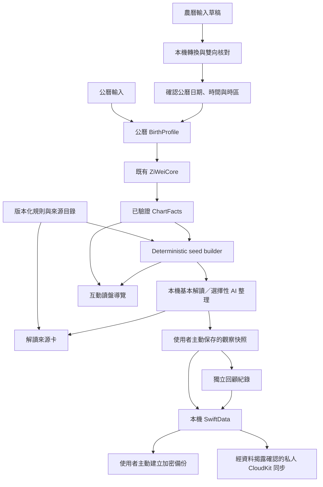

# 五項功能分階段實作計畫

## Goal

深化三合派綜合解讀、新增互動讀盤導覽、擴充觀察筆記的前後回顧、提供解讀來源卡，以及支援農曆生日輸入。
維持可離線排盤、基本解讀、不需要 App 帳號、無開發者後端、正體中文與漸進式揭露。
使用者已授權在專用分支執行本計畫、簽署提交、推送並建立 pull request，不包含套件發布、版本標籤、發布工作流程或 App 上傳。
人工審閱、額外研究費用與 CloudKit 測試／部署的既有界線仍適用，不能由執行授權推定已取得證據或測試環境。
下列核取方塊依實際證據更新，未完成工作不得宣稱交付完成。

## Context

以下為 2026-09-12 的 repository 查核結果，並非本次執行測試的結果。
路徑前綴 `App/`、`Domain/`、`Interpretation/`、`Persistence/`、`Features/`、`AI/` 與 `ZiWeiCore/` 均相對於 `apps/ios/MightyZiWei/`。
`Tests/` 相對於 `apps/ios/MightyZiWeiTests/`，`UITests/` 相對於 `apps/ios/MightyZiWeiUITests/`。
未存在的檔名均為計畫中的新增檔案。

| 功能 | 已有基礎 | 本次需要補足的差距 |
| --- | --- | --- |
| 綜合解讀 | `Interpretation/InterpretationSeedBuilder.swift` 產生五個 baseline 與十四主星落宮 seeds。 | 身宮、四化、輔煞與三方四正沒有對應的核准個人化 seeds，現行 renderer 只並列線索，不宣稱支持或牽制關係。 |
| 互動導覽 | `Features/Chart/ChartView.swift`、`PalaceDetailView.swift` 與 `ChartLearningContent.swift` 已有分層閱讀及教學文字。 | 缺少可跳過、續讀、逐步標示盤面位置的引導流程。 |
| 前後回顧 | `Persistence/SavedInsight.swift` 與 `Features/SavedCharts/ChartJournalView.swift` 已有可編輯筆記、標記、收藏與自訂提醒。 | 更新筆記或收藏會改寫原內容，沒有獨立的原始觀察快照及後續回顧紀錄。 |
| 來源卡 | 解讀、問答及收藏已有 seed-fact IDs，`InterpretationValidator` 驗證完整配對。 | `InterpretationSeed` 沒有來源、審核紀錄及內容版本；引用 IDs 通過不代表 AI 逐句語意已證明。 |
| 農曆輸入 | `BirthProfile` 只接受公曆，`CalendarNormalizer` 依出生地時區執行 Foundation 公曆轉農曆。 | 沒有農曆轉公曆輸入流程；現有 `LunarDate` 年份是六十年循環值，不能直接當作絕對農曆年。 |

`BackupPayload.currentSchemaVersion` 目前為 2，`SavedChart.schemaVersion` 為 1。
`BackupPayload` 與 `CloudInsightPayload` 會以目前 builder 重新驗證歷史 evidence，擴充規則時必須處理版本相容性。
`AppModelStoreMigrator` 目前處理 store 位置搬移，不等於已具備本次新增模型的 schema migration。
`ICloudSyncService.swift` 已超過 1,000 行；本次若修改它，須先沿 payload、衝突規則與同步協調責任拆分。

Skill 的 `generate_chart_facts.py`、`seed-contract.json` 與 `check_knowledge_coverage.py` 固定假設 19 個 seeds，且 hash 目前只鎖定 builder 檔案。
新增規則或拆出資料目錄後，不能只更新數量與 hash 讓檢查通過，必須同步建立新契約與反例測試。
`RULESET.md` 尚有人工核對 gate，其對話保存敘述與 `PRODUCT.md` 不一致，且 `natal.star.ziwei.palace` 範例與實際 `natal.star.ziWei.palace` 大小寫不同。
完整度量表也有落後於現行 seed-ID validator 的文字。
這些差異須在相關契約階段修正，不能假設文件與測試基準已一致。

## Non-Goals

- 大限、流年、流月、流日、每日吉凶分數與精確事件預測。
- 合盤適配度、出生時辰推定、真太陽時、廟旺利陷、自化、飛化或新增流派切換。
- 所有兩星組合與古籍格局的完整實作。
- 增設主分頁、社群、帳號、開發者 AI 後端、付費點數或圖片分享。
- 自動送出 AI 請求、把私人回顧當成命盤 facts，或以主觀認同統計命理準確率。
- 未取得合法來源與人工審核就讓 AI 補出命理含義。

## Architecture



### 規則、來源與版本

新增獨立的解讀內容版本，不因文案與來源目錄更新提升排盤 `ruleSetVersion`。
只有既有公曆輸入的排盤結果改變時，才依 `RULESET.md` 提升排盤版本並新增 regression fixtures。
來源目錄保存 stable rule ID、claim ID、版本、來源定位、適用條件、禁用推論與審核狀態。
來源定位使用書籍版本與頁碼，或固定數位修訂與章節，不虛構頁碼。
必須分開「已由 App 契約核准使用」、「經專家審閱」、「原始文本存在」與「現代轉譯」的狀態。

新增組合 meaning 只能由明確的組合規則產生，不能由 AI 將兩條互不相關的 seeds 串成因果關係。
第一批範圍限定為身宮六種落宮、生年四化四類，以及命宮、財帛宮、官祿宮、遷移宮的三方四正閱讀。
支持與牽制組合採有限試點清單，上限四條，須至少各有一條通過人工審閱；實際組合由階段 0 的來源查核決定，不在本計畫猜定。
輔煞只納入試點組合確實需要且已審閱的含義，其餘維持 facts-only。
若來源不足，該工作保持未完成；縮減範圍必須取得使用者接受並更新本計畫。

來源卡以本機可核對的 seed／內容段落為單位。
AI 自由文字只有段落引用時，介面必須標為「本段引用依據」，不得標為逐句證明。
新功能不要求另外一次 AI 來源查詢，也不讓模型提供書目、審核狀態或命盤位置。

### 回顧資料與相容性

新增獨立的 `SavedObservation` 與 `SavedObservationReview`，不把歷史快照塞入會更新的收藏內容。
初始快照保存使用者選取的單段文字、當時 facts 與 seed meanings、內容來源、已知版本、建立時間與初步想法。
之後的回顧使用獨立 ID 與時間，不覆寫初始快照；更正以新增紀錄表示，但使用者仍可明確刪除資料。
舊收藏沒有版本時只標「來源版本未保存」，不得用目前目錄補上歷史認證。
歷史資料只能用於回顧，不能直接重新餵給 builder 或 AI 當成目前已驗證的命理依據。

新模型使用獨立 CloudKit record types，避免舊 App 重寫原有 payload 時靜默移除快照欄位。
舊裝置刪除命盤產生的 tombstone 仍須由新 App 套用至關聯觀察與回顧，避免孤兒資料與刪除後復活。
新的同步資料種類需重新揭露並確認，既有同步開關不視為自動同意新增快照內容。
新資料尚未取得同步同意時仍可本機使用與主動備份。

### 農曆輸入邊界

新增輸入模式與本機 resolver，但 `BirthProfile` 保持公曆 source-of-truth，不新增含糊的 `.lunar` 值。
農曆年以「該農曆新年所在公曆年」標示，搭配月、日與閏月欄位；不得只用干支年或循環年辨識。
最終公曆結果仍限定 1900-01-01 至 2099-12-31，支援邊界由轉換後的日期判定。
依目前出生地時區與完整當地時間核對，不擅自改成台灣時區，也不把閏月輸入先套用「閏月作下月」排盤規則。
本階段只保存使用者確認的公曆資料；農曆輸入草稿與模式不永久保存，避免為輸入便利新增命盤 migration。

## Unknowns

| 待確認項目 | 解決工作 | 無法解決時的處置 |
| --- | --- | --- |
| 身宮、四化與試點組合有哪些合法、充分且不依賴未支援規則的來源？ | 階段 0 建立有限 claim 清單及逐條來源紀錄。 | 保留 facts-only，不啟用缺證據的個人化含義。 |
| 誰能審閱三合派規則與正體中文安全文案？ | 階段 0 記錄審閱者、範圍、內容版本與交付方式。 | 人工 gate 維持開放，不由 agent 自行認證。 |
| Foundation 反向曆法轉換在海外時區、跨年與歷史時間是否符合既有規則？ | 階段 0 建立實驗與獨立 fixtures，階段 5 完成雙向核對。 | 拒絕無法唯一確認的輸入，不靜默修正既有排盤。 |
| 新舊 App 共用 CloudKit 時如何保護歷史 evidence 與刪除關係？ | 階段 0 定義相容矩陣，階段 4 使用版本化 payload 與獨立 record types 驗證。 | 停用新增資料的同步，保留既有可用資料，待相容性通過。 |
| 現有完整度 checker 與測試基準是否通過？ | 階段 0 執行本機基準檢查，記錄原有失敗與新增失敗。 | 不降低檢查條件，不把原有失敗藏成新功能通過。 |

## Plan

依序執行階段 0 至 6，只在取得實作授權後開始。
來源卡先於綜合解讀建立，因為它提供新規則共用的來源與版本基礎。
導覽與農曆 resolver 的純 facts／曆法工作可在共同契約確認後獨立開發，但不得跨過各自驗收 gate。
所有任務只在列出的驗收證據成立後勾選，將測試命令、結果與人工審核紀錄位置補在對應項目下。

### 階段 0：凍結範圍與建立基準

- [x] 執行下方本機單元測試與 Skill checker 基準命令，記錄成功與既有失敗；以退出碼及本機測試結果路徑驗收，不把本次計畫檢查當成 App 測試。
  - 基底：`origin/main`，commit `b4853d6dfd20089e4be7b1f69395c8e545069651`；分支：`narumi/feat/five-feature-expansion`。
  - 2026-09-12：iPhone 17 Pro／iOS 26.5 單元測試退出碼 0，208 項通過、0 項失敗、0 項略過；尚未執行 UI 測試。
  - 單元測試結果：`/tmp/mighty-ziwei-five-feature-baseline/UnitTests.xcresult`；文字摘要：`/tmp/mighty-ziwei-five-feature-baseline/unit-summary.json`。
  - 命盤產生器退出碼 1，拒絕目前 builder 與 seed contract hash 不符；contract 為 `c7c22022a3ad75a48b88dfcf23e4387569a4fb7b74c84cb8e261064535b4946d`，實際為 `549d5261f856d9157a09523bd0756a06e528279fc512d9a2ea3c414de4d09aa2`。
  - Skill checker `--self-test` 退出碼 1，既有完整度檢查為 80/100；回報 builder hash 不符，以及 Star、PalaceKind、TransformationKind 集合不同步，反例測試通過。
  - Skill 文字紀錄：`/tmp/mighty-ziwei-five-feature-baseline/knowledge-check.log`；尚未修正、放寬檢查或宣稱 Skill 驗收通過。
  - 此項勾選只表示基準結果已完整記錄，不代表失敗檢查已修復或五項功能已完成。
- [ ] 新增 `docs/interpretation/sanhe-claim-ledger.md`，列出本計畫限定的身宮、四化、四宮結構與不超過四條試點組合；每項包含來源、必要 facts、meaning、排除條件、狀態與正反案例，以逐項可追溯且沒有匿名待補規則驗收。
- [ ] 在 claim 證據帳記錄專家與文案審閱安排；以審閱者明確接受範圍及未完成 gate 的紀錄驗收，不能以安排完成冒充內容審核完成。
  - 阻擋：目前尚未提供接受本計畫範圍的人工審閱者或新規則核准紀錄，repository 的規則與來源文件仍明確標示待審。
  - 解除條件：提供審閱者接受範圍的可追溯紀錄，之後逐條取得身宮、四化、四宮結構與支持／牽制試點的審閱證據；不能由 agent 自行簽核或用 facts-only 降級冒充完成。
- [ ] 新增 `docs/interpretation/compatibility.md`，凍結內容版本、歷史引用、新舊 App／備份／CloudKit 相容矩陣及失敗處置；以涵蓋現行備份 v1、v2、舊對話、無版本收藏與新觀察資料驗收。
- [ ] 在 `Tests/Calendar/LunarBirthResolverTests.swift` 建立反向曆法研究案例，確認絕對農曆年、閏月及海外時區的唯一性；以可重現案例及獨立來源記錄驗收，不從正反向自我一致推定曆法正確。
- [ ] 更新 `PRODUCT.md` 的分期範圍與輸入／回顧資料政策，解決 `RULESET.md` 相關舊對話敘述、fact ID 大小寫差異及完整度量表的過時 validator 說明；以與實際程式及本計畫邊界逐項一致驗收。

### 階段 1：來源卡與內容版本基礎

- [ ] 新增 `Interpretation/InterpretationSourceCatalog.swift` 與內容版本型別，建立本機 rule／claim／來源的可追溯對照；以新增 `Tests/Interpretation/InterpretationSourceCatalogTests.swift` 驗證未知 ID、版本衝突、缺少來源與狀態不可混用。
- [ ] 為現行 seeds 建立來源對照與 legacy 政策，保留既有 ID 及 meaning；以現行 builder 測試及未具專家證據的項目不得顯示「已審閱」驗收。
- [ ] 調整 `PersistedInterpretationEvidenceValidator` 及歷史資料讀取路徑，分開目前可用 evidence、已知歷史版本與無版本封存文字；以新增歷史 evidence 測試確認內容可讀但不能冒充目前已核准依據。
- [ ] 新增 `Features/Interpretation/InterpretationSourceView.swift`，由解讀與問答的既有 evidence 區塊展開來源卡；以 UI 測試確認預設不展開、本機資料離線可讀、引用可定位、缺少資料有明確狀態，外部來源只在使用者主動開啟時連網，且不增加 API 請求。
- [ ] 將收藏詳情接入同一來源卡，對無版本舊收藏顯示限制而非補造來源；以 `SavedInsightTests` 與收藏 UI 測試確認舊資料仍可閱讀及刪除。

### 階段 2：有限範圍的三合派綜合解讀

- [ ] 完成 claim 證據帳內本階段規則的逐條人工審閱，記錄版本、日期與結論；以身宮六種、四化四類、四宮結構及試點支持／牽制規則皆有可核對核准紀錄驗收，未核准者不得進入執行目錄。
- [ ] 新增 `Interpretation/SanheInterpretationRules.swift`，以 typed facts 判斷個別與組合條件；以新增 `Tests/Interpretation/SanheInterpretationRulesTests.swift` 驗證本宮／對宮／三合宮不混用、化星與落宮完整引用，以及部分條件不冒充完整組合。
- [ ] 擴充 `InterpretationSeedBuilder` 產生版本化組合 seeds；以同輸入同結果、必要 fact 缺少即不產生、不完整 facts 集合不能證明某訊號不存在、同一訊號不重複計數，以及至少兩個獨立訊號才產生綜合傾向的測試驗收。
- [ ] 更新 `RuleBasedInterpreter` 呈現摘要、支持線索、牽制線索與限制；以五個固定分類持續有離線內容、只有 facts 的項目不新增含義，以及沒有規則時維持基本解讀驗收。
- [ ] 更新 AI 請求資料與 `InterpretationValidator` 的新 seed 支援，保留基本版與有效 AI 版並存；以 `OpenAIResponsesInterpreterTests`、`InterpretationValidatorTests`、`ChartAssistantStoreTests` 驗證完整引用、未知組合拒絕、提示注入、失敗及取消保留內容。
- [ ] 更新 Skill 的 `seed-contract.json`、`generate_chart_facts.py` 與 `check_knowledge_coverage.py`，涵蓋所有拆出的規則來源與資料 hash；以有限規則集合、精確 meaning、條件與 evidence 順序測試取代固定 19 個 seeds 假設，並驗證篡改條件、meaning、hash 或來源狀態必定失敗。
- [ ] 更新 Skill 的支援矩陣、產品整合邊界及受影響的判讀／完整度文件；以本機 checker `--self-test` 成功及人工檢查確認未支援項目仍明確停止，不把完整度分數宣稱為命理效度或專家認證。

### 階段 3：互動讀盤導覽

- [ ] 新增 `Features/Chart/ChartReadingGuide.swift`，定義「命宮、主星、三方四正、解讀依據」四步及純本機進度；以新增導覽 model 測試驗證前後步驟、跳過、重開、完成及不同命盤不共用錯誤位置。
- [ ] 新增 `Features/Chart/ChartReadingGuideView.swift` 並由命盤探索區提供次要入口，重用既有宮位顯示；以 UI 測試確認每步一個主要操作、退出後主要閱讀／問答入口仍可見，且不新增主分頁。
- [ ] 建立以命盤身分、ruleset 與導覽內容版本區分的本機續讀狀態；以測試確認 App 重開可續讀、命盤刪除可清除進度、版本失效可安全重啟，以及未儲存命盤只保留本次進度。
- [ ] 為空宮與未具核准 meaning 的步驟提供 facts-only 教學；以空宮案例、VoiceOver 線性替代、最大 Dynamic Type、Dark Mode 與 Reduce Motion 的 UI／人工檢查驗收，不把對宮主星搬成本宮星曜。

### 階段 4：觀察快照與前後回顧

- [ ] 新增 `Persistence/SavedObservation.swift` 與 `SavedObservationReview.swift`，分開不可覆寫的起始快照與可新增的回顧；以新增 `Tests/Persistence/SavedObservationTests.swift` 驗證版本與依據保存、回顧不改原文、刪除關係、缺少版本不回填認證。
- [ ] 更新 `AppModelContainerLoader` 的 schema 與 migration 路徑；以在本機暫存路徑建立的舊版 store 測試驗證命盤、筆記、收藏、對話及 tombstones 不遺失，失敗不建立空白替代資料庫。
- [ ] 沿 payload／衝突策略／同步協調責任拆分 `ICloudSyncService.swift`；以現有 `PracticalFeaturesTests` 的同步、衝突、提醒及刪除測試全數維持通過，且所有受影響來源檔不超過 1,000 行或附具體保留理由驗收。
- [ ] 擴充 `BackupPayload` 與 `BackupRestoreService` 至新 payload 版本，保持加密封裝不變；以 `EncryptedBackupServiceTests` 與新增 restore 測試驗證 v1／v2 遷移、新版快照往返、未知版本拒絕、引用完整性、重複 ID 與失敗原子性。
- [ ] 新增觀察與回顧的獨立 CloudKit payload、同步協調及刪除處理；以 mock 測試驗證舊裝置修改原筆記不改快照、命盤 tombstone 清除子資料、同一回顧重試不重複、部分遠端失敗保留本機，以及不同裝置回顧不互相覆蓋。
- [ ] 擴充 `Features/SavedCharts/ChartJournalView.swift` 的「開始觀察」與「新增回顧」流程；以 UI 測試確認儲存前揭露選取內容、回顧同時呈現原始想法與新紀錄，以及「符合／不符合／尚無法判斷」不轉成準確率。
- [ ] 更新 `ReviewReminderScheduler`、刪除命盤及刪除全部資料路徑，處理新模型的提醒與關聯；以提醒授權拒絕仍可保存觀察、儲存失敗不取消有效舊提醒、刪除後沒有孤兒提醒驗收。
- [ ] 更新 `docs/PRIVACY.md`、同步啟用揭露與備份確認畫面；以 UI／payload 測試驗證新資料同步另行確認、未同意不外傳、私人快照不進入 AI prompt／Widget／命盤分享，以及 API 設定與完整對話仍不進入備份。

### 階段 5：農曆生日輸入

- [ ] 新增 `ZiWeiCore/Calendar/LunarBirthResolver.swift` 與獨立的農曆輸入型別，回傳唯一且有效的公曆 `BirthProfile`；以階段 0 案例驗證絕對農曆年、閏月、大小月、無效日期、跨年與結果範圍，不靜默採用 Foundation 的日期正規化結果。
- [ ] 擴充 `Tests/Calendar/LunarBirthResolverTests.swift` 及純文字曆法 fixtures；以獨立來源核對農曆新年、閏月、1900／2099 邊界，再以有限全範圍日期 sweep 驗證轉換往返與唯一性，清楚區分獨立證據及自我一致測試。
- [ ] 更新 `Features/BirthInput/BirthInputView.swift` 的公曆／農曆選擇與確認摘要；以 UI 測試驗證切換模式不靜默改日期、無效草稿保留、沒有該閏月時明確拒絕，以及使用者確認後才產生命盤。
- [ ] 將農曆模式接入既有當地時間檢查、重複時間確認與相鄰時辰比較；以子時／午夜、夏令時間不存在／重複、海外時區及裝置語系不同的測試驗證出生地民用時間政策不變。
- [ ] 驗證農曆入口與對應公曆入口產生相同命盤與重複命盤判定；以全部既有 golden fixtures、`SavedChartTests`、分享／備份／同步測試確認 `BirthProfile` 與排盤 v1 不因新增輸入方式而改變。

### 階段 6：整合與交付

- [ ] 更新 `README.md`、`PRODUCT.md`、`RULESET.md` 與支援文件的實際功能範圍；以五項功能、來源狀態、資料保存與不支援項目和最終程式一致驗收，未完成的發布 gate 維持開放。
- [ ] 對所有新增或修改的 Swift 檔案先格式化，再執行兩套 strict lint；以同一份明確檔案清單的三個命令皆成功驗收，環境失敗不得勾選。
- [ ] 執行全部單元測試、UI 測試與 Skill checker；以退出碼、有限測試案例及本機結果路徑驗收，修正失敗後重跑受影響測試，不能刪除反例或放寬契約來通過。
- [ ] 執行三合派內容與正體中文人工品質檢查；以至少 20 張代表命盤、每張五分類、100% evidence 契約通過、零高風險／確定事件違規，以及至少 80% 解讀可讀性達 4/5 驗收，並另外確認試點支持／牽制案例確實出現。
- [ ] 執行五項功能的人工端到端檢查；以離線、無 API、App 鎖、無障礙、舊資料升級與雙裝置同步案例紀錄驗收，CloudKit 實機驗證只能在使用者另行授權的測試帳號／環境進行。
- [ ] 整理交付紀錄並取得使用者接受；以未完成事項為零或已明確接受且更新範圍驗收，不執行 App 上傳，全部實作與完成檢查成立後才刪除此計畫並回報路徑。

### 驗證命令

以下命令供實作與重跑驗證使用，已執行的基準命令與結果記錄於階段 0。
目前未修改 Swift、未執行格式化或 UI 測試，沒有宣稱最終驗收通過。
已確認本機 Xcode 26.6、`iPhone 17 Pro` 模擬器及 `xcrun swift-format` 可用。
系統 `xcode-select` 目前指向 CommandLineTools，`swift-format` 不在一般 PATH，因此明確設定 `DEVELOPER_DIR` 並使用 `xcrun`。

從 repository 根目錄執行 Skill 檢查，結果只放本機暫存目錄。

```bash
export DEVELOPER_DIR=/Applications/Xcode.app/Contents/Developer
CHECK_ROOT="$(mktemp -d /tmp/mighty-ziwei-five-features-check.XXXXXX)"
uv run python skills/interpreting-ziwei-natal-chart/scripts/generate_chart_facts.py \
  --date 1990-01-01 --time 12:00 --timezone Asia/Taipei \
  --output "$CHECK_ROOT/chart-facts.json"
uv run --with hanzidentifier==1.3.0 python \
  skills/interpreting-ziwei-natal-chart/scripts/check_knowledge_coverage.py --self-test
```

從 `apps/ios/` 執行 Swift 格式化與 lint。
呼叫者必須把所有變更的 Swift 路徑逐一加入 `SWIFT_FILES`，包含新檔、測試與各階段拆分後的檔案，不使用整個 repository 作為範圍。
以下檔案是陣列語法範例，執行前須替換為當次實際完整清單；在 Bash 中執行。

```bash
export DEVELOPER_DIR=/Applications/Xcode.app/Contents/Developer
SWIFT_FILES=(
  MightyZiWei/Interpretation/InterpretationSeedBuilder.swift
  MightyZiWeiTests/Interpretation/InterpretationSeedBuilderTests.swift
)
xcrun swift-format format --in-place "${SWIFT_FILES[@]}"
xcrun swift-format lint --strict "${SWIFT_FILES[@]}"
swiftlint lint --strict --config .swiftlint.yml --no-cache "${SWIFT_FILES[@]}"
```

從 `apps/ios/` 執行 XcodeGen 與測試，`-derivedDataPath` 及 `-resultBundlePath` 均指定本機暫存路徑。
新增或移動來源檔後須重新產生 project，並檢查產生的文字差異。

```bash
export DEVELOPER_DIR=/Applications/Xcode.app/Contents/Developer
TEST_ROOT="$(mktemp -d /tmp/mighty-ziwei-five-features-test.XXXXXX)"
xcodegen generate
xcodebuild test \
  -project MightyZiWei.xcodeproj \
  -scheme MightyZiWei \
  -destination 'platform=iOS Simulator,name=iPhone 17 Pro' \
  -derivedDataPath "$TEST_ROOT/DerivedData" \
  -resultBundlePath "$TEST_ROOT/UnitTests.xcresult" \
  -only-testing:MightyZiWeiTests \
  CODE_SIGNING_ALLOWED=NO
xcodebuild test \
  -project MightyZiWei.xcodeproj \
  -scheme MightyZiWei \
  -destination 'platform=iOS Simulator,name=iPhone 17 Pro' \
  -derivedDataPath "$TEST_ROOT/DerivedData" \
  -resultBundlePath "$TEST_ROOT/UITests.xcresult" \
  -only-testing:MightyZiWeiUITests \
  CODE_SIGNING_ALLOWED=NO
```

需要分組執行時使用明確的 `-only-testing` target／test class，保留每組結果並涵蓋全部測試，不以單一 smoke test 取代完整驗收。
所有 Bash 工具呼叫 timeout 設為 300 秒；超時屬於未完成驗證，檢查殘留測試程序後再安排分組，不開互動式工具或盲目重跑。
測試生成的 `.xcresult`、資料庫、PDF、圖片與其他二進位檔僅留在本機暫存路徑，不暫存、提交、上傳或傳送。
外部來源另行查核時只保存合法的文字書目、必要短摘錄與定位資料。

## Risks

| 風險 | 處置及驗收界線 |
| --- | --- |
| 組合解讀只是把單星文字拼接成新主張。 | 組合需要獨立核准的條件與 meaning，缺少任一必要訊號就不產生；人工審閱與正反測試均不可省略。 |
| 來源可追溯被誤解為科學證明或專家認證。 | 來源卡分開文本、轉譯、App 契約及專家審核狀態，不顯示預測準確率。 |
| 舊引用被新版 catalog 重新詮釋。 | 保留內容版本與歷史文字，未知版本只能封存閱讀；不回填不存在的審核證據。 |
| 新資料被舊裝置同步或刪除流程破壞。 | 使用獨立 record types、版本化 payload 與父命盤 tombstone 測試；不相容時停用新資料同步而非刪資料。 |
| 農曆轉換在不同時區不一致。 | 固定沿用目前時區語意，使用獨立 fixtures、雙向核對與唯一性檢查；規則若需改動，另行提升版本。 |
| 功能擠壓主要閱讀流程。 | 不新增主分頁，導覽與來源卡由使用者展開；主操作、儲存狀態與錯誤資訊始終可見。 |
| 測試、審核或平台環境不可用。 | 保持相關核取方塊未勾選，明列所需外部條件，不把 mock 通過宣稱為實機或人工驗收。 |

## Rollback / Recovery

- 新規則可停用並回到既有基本 seeds，但保留歷史 catalog 與快照的讀取支援，不以降版 App 直接開啟新 store 作為復原方式。
- schema migration 在本機暫存的舊版 store 副本上先驗證；遷移失敗保留原資料及可重試錯誤，不自動重建空白資料庫。
- 備份還原先驗證全部 payload 與引用，再原子套用；失敗不取消現有提醒、不半套用刪除，新的復原金鑰不寫入 repository。
- CloudKit 已送出的部分遠端變更不能假定可復原，失敗保留啟用狀態與本機有效資料，使用固定 ID 冪等重試。
- 停用新增同步種類只停止後續傳送，不代表已刪除遠端資料；遠端刪除與 schema 部署均須另外明確授權。
- 關閉農曆入口不修改任何已確認並儲存的公曆 `BirthProfile`。

## Completion Checklist

- [ ] 五項功能均完成對應階段與驗收；有限組合清單已凍結、所有必要人工 gate 已有證據，未以 facts-only 退回冒充綜合解讀完成。
- [ ] 既有公曆輸入 golden charts 不變；若發現必須修正的既有規則，已經另行確認範圍、提升 ruleset version 並補測試。
- [ ] 新舊命盤、筆記、收藏、對話與觀察資料在本機、備份及同步相容矩陣中均有成功／安全拒絕證據，沒有靜默資料遺失或歷史認證回填。
- [ ] 五個固定解讀分類、來源卡與導覽在無 API／離線時可用，私人回顧未成為命理 facts 或自動送出內容。
- [ ] 所有變更 Swift 檔案的格式化、兩套 strict lint、全部單元／UI 測試及 Skill checker 已通過並記錄結果，沒有藉放寬既有檢查掩蓋基準失敗。
- [ ] 專家內容審閱、20 張命盤品質 gate、VoiceOver／Dynamic Type／Dark Mode／Reduce Motion 與經授權的同步驗證均有有限案例紀錄。
- [ ] 文件與實際功能一致，來源、相容性及曆法未知事項已解決或由使用者接受調整，全部風險有明確處置。
- [ ] 使用者已接受交付，沒有二進位檔案進入 repository 或外傳，且未把完成實作視為獲准上傳或部署；至此才刪除本計畫並回報路徑。
